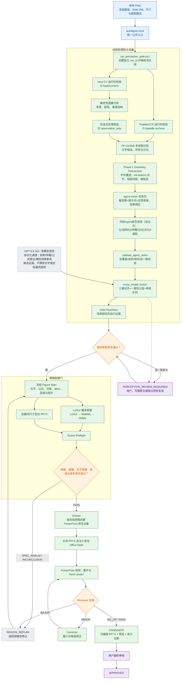

# AI AutoFigure 项目结构图

```mermaid
flowchart TD
    A["参考 PNG<br/>冻结路径、SHA-256、尺寸与颜色模式"] --> B["autofigure.cmd<br/>统一公开入口"]
    B --> C["run_perception_gate.ps1<br/>创建独立 run_id 并编排流水线"]

    subgraph P["绘制前感知与测量"]
        direction TB
        C --> D["Host CV 运行时校验<br/>D:\\opencv\\env"]
        C --> E["PaddleOCR 运行时校验<br/>D:\\paddle ocr\\env"]
        D --> F["确定性图像分析<br/>背景、颜色、像素结构"]
        F --> G["启发式区域候选<br/>仅 observation_only"]
        E --> H["PP-OCRv6 多视图识别<br/>文字候选、冲突与方向"]
        G --> H
        H --> I["Phase-1 Geometry Refinement<br/>字形墨迹、ink-bottom 对齐、局部间距、框候选"]
        I --> AVP["agent-vision 任务包<br/>裁剪图+提示词+应答骨架，哈希绑定"]
        AVP --> AVG["外层Agent原生视觉（协议化）<br/>Q1结构/Q2仲裁/Q3公式/Q4漏检"]
        AVG --> AVV["validate_agent_vision<br/>全覆盖/坐标/绑定/自一致校验"]
        AVV --> CMF["cross_modal_fusion<br/>三模对齐+一致性分层+审核队列"]
        CMF --> J["Gate Summary<br/>哈希绑定的运行证据"]
    end

    J --> K{"感知审核是否通过？"}
    K -- "否 / 有歧义" --> L["PERCEPTION_REVIEW_REQUIRED<br/>用户、可靠原文或独立视觉复核"]
    L --> K
    K -- "是" --> M["冻结 Figure Spec<br/>文字、公式、对象、bbox、层级与拓扑"]

    subgraph Q["首稿前硬门"]
        direction TB
        M --> N["LaTeX 编译收据<br/>LaTeX → MathML → OMML"]
        M --> O["创建同尺寸空白 PPTX"]
        N --> P1["Scene Preflight"]
        O --> P1
        P1 --> P2{"规格、碰撞、文字容量、连线与画布是否通过？"}
    end

    P2 -- "SPEC_INVALID / INCONCLUSIVE" --> P3["REGION_REPLAN<br/>返回规格层修正"]
    P3 --> M
    P2 -- "PASS" --> R["Drawer<br/>按冻结规格创建 PowerPoint 原生对象"]

    R --> S["关闭 PPTX 后注入原生 Office Math"]
    S --> T["PowerPoint 保存、重开与 fresh render"]
    T --> U{"Reviewer 验收"}
    U -- "MAJOR" --> P3
    U -- "MINOR" --> V["Corrector<br/>最小对象级修正"]
    V --> T
    U -- "NO_OP / PASS" --> W["CANDIDATE<br/>可编辑 PPTX + 预览 + 审计证据"]
    W --> X["用户最终审核"]
    X --> Y["APPROVED"]

    Z["GPT-5.6 Sol / 多模态视觉<br/>协议化通道：结构/仲裁/公式提议/漏检四类查询<br/>候选证据，不拥有文字或坐标最终授权"] --> CMF
    CMF -.-> L

    classDef input fill:#e3f2fd,stroke:#1565c0,color:#0d47a1;
    classDef process fill:#e8f5e9,stroke:#2e7d32,color:#1b5e20;
    classDef gate fill:#fff3e0,stroke:#ef6c00,color:#e65100;
    classDef human fill:#ede7f6,stroke:#6a1b9a,color:#4a148c;
    classDef boundary fill:#eceff1,stroke:#546e7a,color:#263238,stroke-dasharray: 5 5;

    class A,B input;
    class C,D,E,F,G,H,I,J,M,N,O,P1,R,S,T,V,W,AVP,AVG,AVV,CMF process;
    class K,P2,U gate;
    class L,X,Y human;
    class Z,P3 boundary;
```

