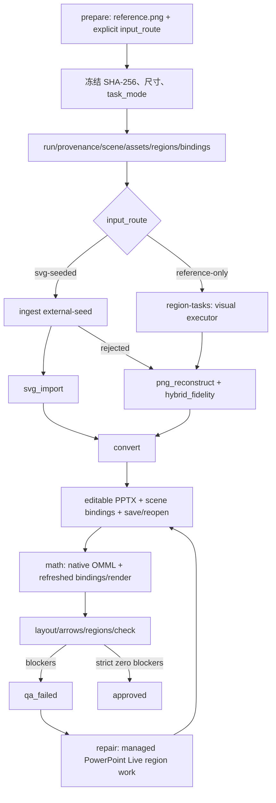

# Autofigure v3.1 架构

## 1. 核心模型

旧设计把“输入来源”和“当前算法”混在 `source_mode` 中，导致案例 01 已回退 PNG 后看起来像从未使用过 Web SVG。v3.1 将它拆成两个正交维度：

| 字段 | 取值 | 生命周期 |
|---|---|---|
| `input_route` | `reference-only` / `svg-seeded` | 建案时显式指定，此后不可变 |
| `processing_mode` | `svg_import` / `svg_repair` / `png_reconstruct` | 可随失败回退改变 |

不变量：

1. `reference-only` 不等于“不能生成 SVG”，只表示没有用户提供的外部 SVG 种子。
2. `svg-seeded` 不绑定模型品牌。
3. SVG 被拒绝只改变 `processing_mode`；目录、`input_route` 和 provenance 不变。
4. 旧 v3 案例必须依据显式迁移表分类，禁止根据现有文件或当前模式猜测。

## 2. 数据流



离线转换器当前以 SVG 作为完整初版的可渲染载体。reference-only 的视觉执行者可以是 Codex、其他 VLM 或人工；项目本身不声称在没有视觉推理的情况下自动理解任意科研图。

## 3. 案例目录

```text
examples/
├─ README.md
├─ route-comparison-<group>.json/.md
├─ reference-only/
│  └─ <globally-unique-case-id>/
└─ svg-seeded/
   └─ <globally-unique-case-id>/
```

每个案例根保持扁平：

```text
<case>/
├─ run.json
├─ provenance.json
├─ reference.png
├─ prompt.md
├─ redraw.svg
├─ redraw.pptx
├─ render.png
├─ preview.png
├─ check-report.md
├─ scene.json
├─ assets.json
├─ regions.json
├─ bindings.json
└─ qa/
```

命令可接收完整嵌套路径或全局唯一 case ID。旧 `examples/<case>/` 只兼容读取并警告，不创建副本或链接。

## 4. v3.1 合同

### `run.json`

- `schema_version=3.1.0`
- `task_mode=RECONSTRUCT_1TO1`
- 不可变 `input_route`
- 可变 `processing_mode`、`fidelity_profile`、`backend_mode`
- 参考相对路径、SHA-256、尺寸
- workflow 与最近一次 standard/strict validation 摘要

禁止保留 `source_abspath` 的权威地位；`source_mode` 只允许迁移读取，不能继续序列化。

### `provenance.json`

记录：参考图相对路径与哈希、外部 SVG 种子（可为 `null`）、候选历史、生成者/接口、时间、A/B `comparison_group`。未知模型明确为 `null` 或 `unknown`，不得猜测。

### 场景控制层

- `scene.json`：稳定对象 ID、语义、几何、层级、连接拓扑和当前 PPTX artifact hash。
- `assets.json`：资产授权、来源、bbox、rights uncertainty、不可约理由、`editable`。
- `regions.json`：关键区域、对象范围、SSIM/Edge IoU、颜色探针和阈值。
- `bindings.json`：scene element 到保存重开后的 shape ID/name、对象类型和后端证据。

## 5. 状态机

允许状态：`prepared / candidate / qa_failed / repairing / approved`。

- `prepare`：`prepared`。
- `ingest`：`candidate`。
- strict 有 blocker：`qa_failed`。
- `repair`：`repairing`。
- strict 零 blocker：`approved`。

standard 永远只是诊断，不授予 approved。strict 没有 critical region 时必须添加 `regions:no-critical-regions`。

## 6. 箭头与布局

普通直线、肘形和可连接曲线优先映射 PowerPoint connector；原生 `headEnd/tailEnd` 支持头型、宽度和长度。复杂 marker 不可原生表达时必须：

1. 明确 warning；
2. 回退为 custom freeform；
3. 杆与头物理分组并共享语义 ID；
4. 头部按路径切线定向。

箭头审计不再把箭头自身路径当目标边界，并检查目标身份、transform、端点、中心线 P95、切线角、交叉和标签碰撞。校准以逐箭头 ID 为单位。

布局合同：

- 容器文字/公式使用 `data-layout-container` 与 padding。
- 重复图元使用 `data-repeat-group/data-repeat-axis/data-repeat-order`。
- source SVG 与保存重开的 PPTX 分别检查；默认容器/同轴/尺寸漂移 ≤0.25 px，相邻中心距范围 ≤1 px。

## 7. 微资产

正式结构必须原生。只有用户明确授权、无法忠实分解且紧边界的微资产允许从当前案例 `reference.png` 裁剪。PowerPoint shape Tags 持久化 asset ID、源哈希、紧边界声明、不可约原因与 `editable=false`。

真实 ModularAgent reference-only A/B 已证明 observation 和 environment globe 两个裁剪区能达到 SSIM/Edge IoU 1.0；这不为其余区域背书。

## 8. PowerPoint Live

离线先生成初版，只对失败区域启动托管可见会话。bridge 在 `qa/powerpoint-live-case/` 中将 Autofigure 场景适配为服务端 Scene 2.1；正式 `scene.json` 仍是源事实。

live 必须显式 case、session、revision 和幂等键，支持 inspect、audit、save/reopen、render 和 object binding。自动状态最多为 `INDEPENDENT_REVIEW_REQUIRED`，没有 release authority。

保存重开成功但没有区域修复结果时，只能记录 backend diagnostic；不能伪造 `live-evidence.json`，strict 仍保留 `live-evidence-missing`。

## 9. 案例索引和 A/B

```bat
autofigure cases --write-index
autofigure cases --check
autofigure compare <svg-seeded-case> <reference-only-case>
```

`cases --check` 验证路线目录、全局 ID、合同、参考哈希、索引和可移植路径。`compare` 要求相同参考哈希、不同路线、相同非空 comparison group，并报告对象数、可编辑文字/公式/箭头、区域 SSIM/Edge IoU/ΔE00、箭头发现、全图诊断和最终状态。

## 10. 插件 provider 边界

统一协议：`discover / health / capabilities / execute / inspect / undo`。原生 PowerPoint provider 最高优先级。第三方插件只有在提供独有、结构化、可回读、幂等且可撤销能力时才可进入。

OneKeyTools10 仅隔离试点；iSlide/ThreeD Tools 按需；其余排除。禁止 Ribbon 坐标点击、SendKeys 和图像识别点击。
