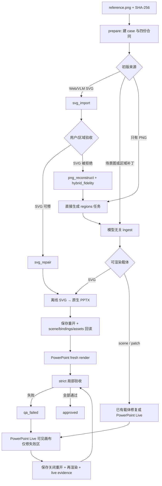

# AI AutoFigure v3 — 项目流程架构

> 更新日期：2026-08-21。v3 在保留轻量离线转换的同时，增加 PNG 高保真回退、场景绑定、局部硬门禁和 PowerPoint Live 区域修复。

## 1. 目标与诚实边界

目标是把科研图 `reference.png` 重建为原生可编辑 PowerPoint：文字、公式、节点和箭头尽量原生；经用户授权的复杂创意微资产允许紧边界位图。

项目不把“能生成 PPTX”当作“一比一重建成功”。初版 SVG 可能很差；自动重建能力取决于模型对参考图的视觉理解、区域任务质量和后续修复。机器能够保证的是：输入/输出可追溯、对象可绑定、失败区域不可被全图均值掩盖、未通过不得标记 `approved`。

## 2. 总流程



PowerPoint Live 不替代离线转换；它是失败区域的昂贵但可见修复层。MCP 不可用时仍可得到离线 candidate，但 hybrid strict 任务不能批准。

## 3. Case 文件合同

```text
examples/<case>/
├─ run.json               参考哈希、模式、状态机
├─ reference.png          唯一冻结视觉基准
├─ redraw.svg             当前 SVG candidate
├─ redraw.pptx            当前 PPTX candidate
├─ render.png             PowerPoint fresh render
├─ scene.json             对象 ID、角色、几何、拓扑、层级
├─ assets.json            微资产授权、bbox、可编辑性
├─ regions.json           局部阈值、颜色探针、关键区域
├─ bindings.json          scene element → PPT shape ID/name
└─ qa/
   ├─ convert-summary.json
   ├─ arrows-audit.json
   ├─ layout-audit.json
   ├─ regions-report.json
   ├─ live-repair-request.json
   └─ live-evidence.json
```

所有合同都绑定 `reference_sha256`。参考图被替换、PPTX 与绑定哈希不一致、保存重开未验证或 shape 回读不完整都会成为 strict blocker。

## 4. 状态机

允许状态：`prepared / candidate / qa_failed / repairing / approved`。

- `prepare` 建立 `prepared`。
- `ingest` 或 `convert` 产生 `candidate`。
- strict 失败写 `qa_failed` 并返回非零退出码。
- PNG 回退或 live 请求写 `repairing`。
- 只有 strict 零 blocker 才写 `approved`。
- 已批准对象若再次转换，必须先回到 `repairing`；不能直接覆盖后仍保留批准状态。

## 5. 转换层

`tools/v2/convert.py` 负责：

- 强制 SVG 根 `width/height/viewBox` 与参考图一一对应。
- 展平 SVG 仿射变换，保留三次贝塞尔曲线。
- 映射原生 rect/ellipse/text/gradient/dash/freeform。
- `stroke="none"` 显式写 DrawingML `a:noFill`，避免 PowerPoint 默认主题轮廓污染。
- 普通直线/直线路径箭头转为 PowerPoint connector。
- 简单 marker 转为 `a:headEnd/a:tailEnd`；复杂 marker 明示回退并物理分组。
- 处理 `data-source-id/data-target-id` 和连接点索引。
- 原子位图仅从参考图 bbox 裁剪；大面积 `<image>` 被拒绝。
- 授权原子位图把 hash-bound asset ID、裁剪图哈希、不可约原因和分解说明写入 PowerPoint shape Tags，供 live 保存重开审计。
- 保存并用 python-pptx 重开，递归回读组内 shape，写稳定名称和 bindings。
- 对声明了 `data-layout-container` 的文字/公式按容器内边界裁掉透明选择框余量；锚点本身在容器外时拒绝静默搬移。
- 对 `data-repeat-group` 同时审计 SVG 与保存重开的 PPT bounds，区分视觉测量错误和转换漂移。
- 以包级 OOXML 回读全部 binding 的实际 bounds，逐对象检查 1429×627 等目标画布；任何方向越界超过 0.25 px 记 `L10` strict blocker。

`math` 注入原生 Office Math 后会再次保存重开，同步更新被改名的公式 shape binding、scene artifact 与 PPTX 哈希。因为 OMML 位于 `mc:AlternateContent`，公式身份使用包级 OOXML 回读；高层 python-pptx 重开仅作为文件兼容性检查。

## 6. 箭头审计

`tools/v2/arrows.py` 不再把箭头自己的 path 当作可停靠边界。审计在画布坐标执行，支持嵌套 transform，并检查：

- F1：marker tip/ref 不对齐。
- F2：逐箭头校准或头/线宽异常。
- F3：端点悬空。
- F5：声明的源/目标对象身份不匹配。
- F6：路径与文字碰撞。
- F7：参考中心线或端点偏差。
- F8：非法/奇异 transform。
- F9：未授权的箭头交叉。
- F10：末端切线角误差。

校准键优先为 `arrow-id:start`、`arrow-id:end` 或 `arrow-id`。旧 marker ID 只保留兼容读取。共享 marker 在逐箭头修复时会克隆，避免全局连带变化。

## 7. 局部 QA

`regions.json` 的 critical 区域使用 SSIM、Edge IoU 和可选 ΔE00 颜色探针。全图指标永远是 diagnostic。默认阈值：

- 普通关键区：SSIM ≥ 0.85，Edge IoU ≥ 0.75。
- 授权微资产：SSIM ≥ 0.95。
- 箭头端点：画布对角线 0.25%。
- 箭头中心线 P95：画布对角线 0.35%。
- 箭头头部角度：3°。
- 案例 01 六圆颜色探针：ΔE00 ≤ 5。

此外，显式布局合同是 strict 硬门：容器子元素的 PowerPoint bounds 不得越界；重复元素尺寸差与同轴漂移默认 ≤0.25 px，连续中心距差默认 ≤1 px；全部绑定对象也不得越出幻灯片画布。报告同时给出 `source` 与 `backend` 两组数值：只有 source 失败说明初始视觉/坐标合同错误，只有 backend 失败说明 SVG→PPT/OMML 转换漂移，两者都失败则先修源再复核转换。

通用 padding-raster 检查器若只通过 python-pptx 平移高层 shape，可能漏移 `mc:AlternateContent` 中的 OMML Choice，从而把公式绘制到新增灰边并误报越界。项目的批准门不依赖这种变异副本，而是对原始 PPTX 做包级 OOXML bounds 审计，并以 PowerPoint 原生保存重开与渲染复核可见结果。

`autofigure check --profile standard` 只诊断；`--profile strict` 才有批准权。

## 8. PowerPoint Live

`autofigure repair <case>` 根据失败区域生成 hash-bound 请求。MCP 操作者必须具备：managed session、visible canvas、native connector/freeform、inspect、audit、save-reopen、object bindings。

Autofigure v3 场景不直接冒充服务端 Scene 2.1。`tools/v2/live_bridge.py` 从当前 `scene.json`、`bindings.json`、PPTX 和授权微资产派生隔离的 `qa/powerpoint-live-case/`，生成服务端要求的 project/source/scene/render/spec/asset/provenance 七份合同。桥接固定 `releaseAuthority=NONE`，要求每个 v3 对象都有 shape binding，并禁止过期 scene 对象进入桥接。服务端内置 `journal-double-column` profile 只承担合同解析；Scene 中的画布仍使用参考图原始像素尺寸。

生产修复禁止 Ribbon 坐标点击、SendKeys 或图像识别点击。live evidence 必须声明 provider、参考哈希、target ID、保存重开、绑定完整性和逐区域结果。AI 自身没有放行权限。

项目 `mcp.json` 仅保留 `powerpoint-live`；启动器动态发现当前 Codex scientific-illustrator 包，避免失效绝对路径。

## 9. Provider 与插件

统一适配协议：`discover / health / capabilities / execute / inspect / undo`。

- `powerpoint-native`：永远最高优先级。
- `powerpoint-live`：只处理失败区域。
- OneKeyTools10：未安装、未选用，仅保留隔离试点资格。
- iSlide：人工素材来源，不是按钮级 MCP。
- ThreeD Tools：明确三维案例后再验证。
- 其余美化/动画/重叠插件：不进入自动化流程。

插件必须同时通过兼容、安全、许可、结构化目标 shape、回读、幂等和 undo，才能从“安装”升级为“MCP 能力”。

## 10. 命令入口

```bat
autofigure prepare reference.png --case my-case
autofigure prepare reference.png --case png-only --source-mode png_reconstruct
autofigure ingest examples\my-case candidate.svg --kind svg
autofigure ingest examples\my-case --rejected --fallback png_reconstruct
autofigure convert examples\my-case
autofigure arrows examples\my-case --fix --calibrate edge-1=8.5
autofigure layout examples\my-case
autofigure check examples\my-case --profile standard
autofigure repair examples\my-case
autofigure check examples\my-case --profile strict --require-live
autofigure providers --json
```

直接 PNG 入口会在 `prepared` 状态生成 `qa/region-tasks.json`，不要求先取得 Web SVG。当前离线初版转换器以 SVG 为可渲染载体；scene/patch 必须绑定已有载体或 PowerPoint Live。集成测试验证的是入口与转换管线，不把视觉模型尚未执行的工作冒充为自动重建结果。

详细边界与插件选择见 [`HIGH_FIDELITY_V3.md`](HIGH_FIDELITY_V3.md)。
