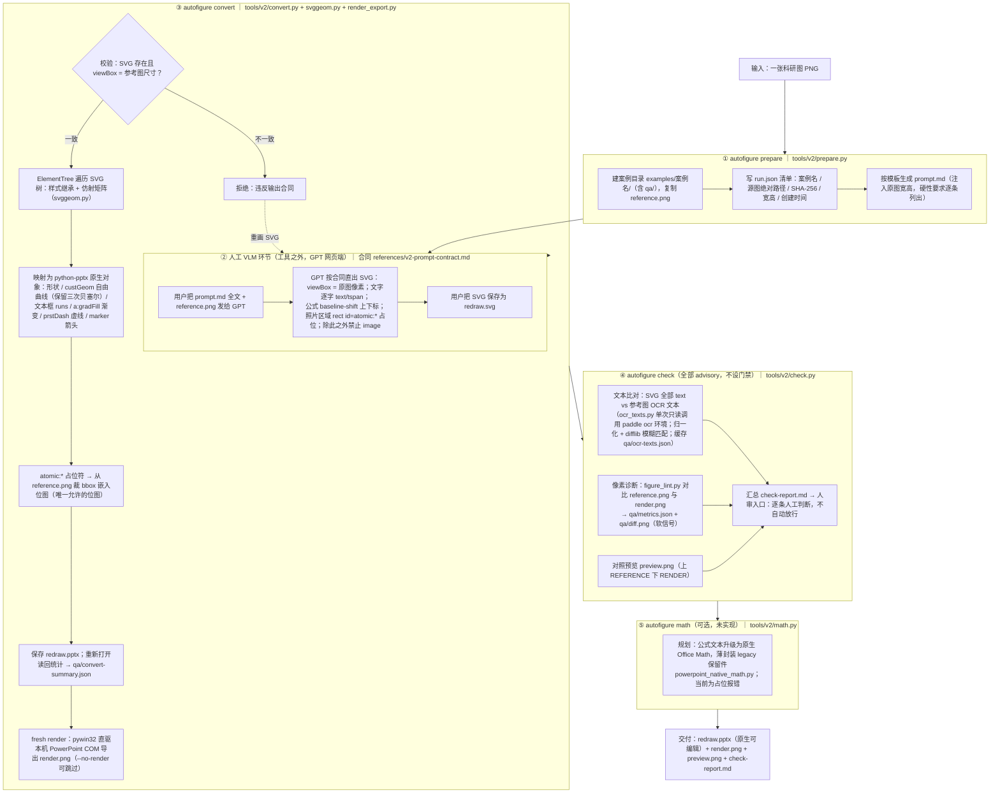

# AI AutoFigure v2 — 项目流程架构

> 更新日期：2026-08-19。描述对象：`D:\AI+科研\AI智能绘图（最终版）\AI autofigure` 当前 git HEAD（v2 架构，examples 案例平铺重构后）。
> 正式工作指令见 `SKILL.md` 与 `references/v2-prompt-contract.md`；本文是全景架构说明，不替代这两份合同。

## 1. 项目定位与架构原则

把科研论文插图（PNG）高保真重建为**原生可编辑 PowerPoint**（.pptx）：文字 100% 原生文本框可编辑读回、公式保留上下标、照片区域原图裁剪嵌入、形状/渐变/箭头全部为原生对象。

架构原则一句话：**VLM-first, verify-light**——

- **VLM 负责"看"**：GPT 网页端（多模态大模型）看参考图、按输出合同重绘为 SVG。感知能力外包给 VLM，工具链不做任何确定性图像感知（无 OCR 几何分析、无区域检测、无图像分割）。
- **工具负责"确定性"**：本工具把 SVG 确定性地转换为原生 PPTX 对象，并做轻量核验（文本比对 + 像素诊断 + 对照预览）。
- **验收靠人审**：所有机器输出都是 advisory（软信号），不设自动门禁。通过证据 = 文本可编辑读回 + check 报告逐条人审。

这一架构是 2026-08-18 用同一张参考图、同一把诊断尺实测对比后确立的：v1 重型确定性管线（4 天、约 30 轮迭代、27k LOC）已整体归档至 `legacy/`，缘由见 `legacy/README.md`。

## 2. 总流程图



## 3. 仓库目录结构

```
AI autofigure/
├── autofigure.cmd              统一入口（纯 ASCII；定位 .venv 后 python -B -m tools.v2 %*）
├── SKILL.md                    正式工作指令（四步流程、红线、交付物）
├── AGENTS.md                   代理边界与运行隔离约定
├── README.md                   项目门面（架构理由、基准指标、快速开始）
├── PROJECT_ARCHITECTURE.md     本文
├── pyproject.toml              ruff/pytest 配置
├── requirements-v2.txt         v2 依赖（python-pptx/pywin32/numpy/jsonschema/scikit-image/pytest/ruff）
├── requirements.txt            v1 遗产依赖（随 legacy 归档）
├── mcp.json                    v1 遗产 MCP 注册，v2 不依赖
│
├── tools/
│   ├── v2/                     ★ v2 全部代码（约 1.6k 行）
│   │   ├── __main__.py         命令分发：prepare/convert/check/math
│   │   ├── common.py           案例目录约定、Run dataclass、create_run/open_run、SHA-256
│   │   ├── prepare.py          建案例目录 + 生成 prompt.md 提示词包
│   │   ├── convert.py          SVG → 原生 PPTX（788 行，核心）+ 读回统计 + 触发 render
│   │   ├── svggeom.py          SVG path d 属性解析（含 S/Q/T/A 归一化）、2D 仿射矩阵
│   │   ├── render_export.py    PowerPoint COM fresh render（pywin32 直驱）
│   │   ├── check.py            verify-light 三件套 + check-report.md 生成
│   │   ├── ocr_texts.py        OCR 助手（在 D:\paddle ocr 解释器下运行，只读）
│   │   └── math.py             占位（薄封装 legacy 公式引擎，未实现）
│   ├── figure_lint.py          像素诊断器（软信号，非门禁）
│   ├── output_policy.py        输出允许域约束（examples/）
│   └── powerpoint_native_math.py  v1 公式引擎保留件（3518 行，math 命令待用）
│
├── references/
│   └── v2-prompt-contract.md   ★ VLM→SVG 输出合同（prompt.md 的规范来源）
│
├── examples/                   ★ 每案例一个扁平目录（详见 §5），索引见 examples/README.md
│   ├── 01-modular-agent/       完成（GPT 直出 SVG）
│   ├── 02-thinking-diffusion/  完成（手写 SVG 验证合同可遵循性）
│   └── 03-llmind/              prepare 完成，待 VLM 取回 SVG（含照片区域，检验 atomic: 约定）
│
├── tests/v2/                   pytest 套件（test_convert / test_check / test_svggeom）
│
├── legacy/                     v1 重型管线归档（2026-08-18），不维护、不修改
│   ├── README.md               归档缘由
│   ├── ocr-config.json         ★ 仍在使用：check 的 OCR 锁定配置（PP-OCRv6）
│   ├── native-math-poc/ schemas/ tests/ tools/ v1-final-evidence/ …
│   └── *.json                  v1 各类配置现场
│
└── .venv/                      v2 隔离环境（基座 D:\anaconda\python.exe 3.12）
```

## 4. 各阶段详解

### 4.1 prepare（`tools/v2/prepare.py`）

```bat
autofigure prepare <ref.png> [--case 名] [--cases-root 目录]
```

- `common.create_run()`：案例目录 `examples/<case>/` 已存在且非空即拒绝（重跑约定是直接覆盖案例内文件，历史由 git 承担）；复制参考图为 `reference.png`；计算 SHA-256 与像素尺寸写 `run.json`。
- 按 `PROMPT_TEMPLATE` 生成 `prompt.md`：注入原图宽高，逐条列出硬性要求（viewBox 精确、文字逐字、公式上下标、atomic 占位、禁止 `<image>`、只输出 SVG）。
- 打印后续指引：把 prompt.md 全文 + PNG 发给 GPT，取回 SVG 存为 `redraw.svg`，然后跑 convert。

### 4.2 人工 VLM 环节（工具之外）

唯一的"智能"环节，刻意保持在工具链之外：GPT 网页端按 `references/v2-prompt-contract.md` 输出 SVG。合同要点：

| 要求 | 内容 | 违约后果 |
|---|---|---|
| 画布精确 | `width/height/viewBox` = 原图像素，坐标不缩放 | convert 校验不符直接拒绝 |
| 文字逐字 | 全部 `<text>`/`<tspan>`，禁止画成路径 | 文字不可编辑，违背项目目标 |
| 公式 | 变量斜体；`<tspan baseline-shift="sub\|super">` 上下标 | check 文本比对逐条列出 |
| 照片/写实图标 | `<rect id="atomic:语义名" …>` 占位，不重绘 | convert 自动从参考图裁剪嵌入 |
| 其他位图 | 禁止 `<image>` | convert 跳过并记 warning |
| 结构 | 渐变 `<linearGradient>`、箭头 `<marker>`、虚线 `stroke-dasharray` | radialGradient/marker-mid 暂不支持，记 warning 降级 |

### 4.3 convert（`tools/v2/convert.py`，核心）

**映射表**（SVG → OOXML/python-pptx）：

| SVG | PPTX 原生对象 |
|---|---|
| `rect` / `circle` / `ellipse` | 原生形状（圆角矩形保留半径） |
| `line` / `polyline` / `polygon` | 连接器 / custGeom 自由曲线 |
| `path` | custGeom 自由曲线（保留三次贝塞尔；S/Q/T/A 归一化） |
| `text` / `tspan` | 原生文本框 runs（字号/颜色/斜体/粗体/字体；`baseline-shift` → OOXML baseline 上下标 ±30000/-25000） |
| `linearGradient` | `a:gradFill` 渐变填充 |
| `stroke-dasharray` | OOXML 合法 `prstDash` 枚举 |
| `marker` | 自由曲线箭头 |
| `<rect id="atomic:*">` | 从 reference.png 裁 bbox 嵌入位图（唯一允许的位图） |
| `<g>` | 拍平处理（样式/变换正确继承，不产生原生 group） |

**关键常量**：`EMU_PER_PX=9525`、`PT_PER_PX=0.75`（96 dpi）、`BASELINE_ASCENT=0.95`（实测标定的文本框顶到首行基线比例）。

**产出与自检**：保存 `redraw.pptx` 后重新打开读回统计（slide 数、shape 数、含文本的文本框数、各元素发射计数、warning 列表）写 `qa/convert-summary.json`——这是"文本 100% 可编辑读回"红线的机械证据。随后默认调 `render_export.render()` 用本机 PowerPoint COM 导出同尺寸 `render.png`（fresh render，禁止用截图冒充）。

### 4.4 check（`tools/v2/check.py`）

三件套全部 advisory：

1. **文本比对**：`_svg_texts()` 抽 SVG 全部文字，与 OCR 文本做 NFKC 归一化 + 小写 + 希腊字母保留的精确/包含匹配，剩余项 `difflib` 模糊匹配（阈值 0.8，容忍 OCR 的 l/I/破折号噪声）。OCR 通过子进程调用 `D:\paddle ocr\env\python.exe -I -B -X utf8 tools/v2/ocr_texts.py legacy/ocr-config.json reference.png qa/ocr-texts.json`（单次、只读、超时 900s；结果缓存，`--re-ocr` 强制重跑，`--skip-ocr` 跳过）。
2. **像素诊断**：`tools/figure_lint.py reference.png render.png --diff-out qa/diff.png`，指标（mean_abs_rgb_delta / SSIM / changed_pixel_ratio / top_roi）写 `qa/metrics.json`。
3. **对照预览**：`preview.png` 上下拼接参考图与渲染图（红色分隔带标注 REFERENCE/RENDER）。

汇总写 `check-report.md`：像素指标 + 双向未匹配文本清单，文末明确"逐条人工判断，不以本报告自动放行或拦截"。

### 4.5 math（可选，未实现）

`tools/v2/math.py` 当前为占位报错。规划：把 PPTX 中声明的公式文本升级为原生 Office Math，薄封装 v1 保留件 `tools/powerpoint_native_math.py`（解释器纪律见该文件头注释与 legacy 文档）。

## 5. 案例目录约定（examples/<case>/）

案例目录即工作单元，扁平、无历史子目录；重跑覆盖当前最佳，历史由 git 承担。

| 文件 | 产生者 | 说明 |
|---|---|---|
| `run.json` | prepare | 案例清单：case / created_at / source_abspath / source_sha256 / width / height |
| `reference.png` | prepare | 参考图拷贝（OCR 与裁剪的源） |
| `prompt.md` | prepare | GPT 网页端提示词包 |
| `redraw.svg` | 用户放入 | VLM 重绘输出（convert 的输入） |
| `redraw.pptx` | convert | ★ 交付物（原生可编辑） |
| `render.png` | convert | PowerPoint fresh render |
| `preview.png` | check | 参考/渲染对照预览 |
| `check-report.md` | check | 核验报告（人审入口） |
| `qa/` | convert/check | 机器诊断明细：convert-summary.json / metrics.json / diff.png / ocr-texts.json |

## 6. 环境与运行时隔离

| 用途 | 运行时 | 约束 |
|---|---|---|
| v2 全部命令 + figure_lint + pytest | 项目内 `.venv`（基座 `D:\anaconda\python.exe` 3.12，依赖见 `requirements-v2.txt`） | 不得装进其他环境 |
| check 的 OCR | `D:\paddle ocr\env\python.exe`（PP-OCRv6） | 只读单次调用；配置锁定 `legacy/ocr-config.json`；不下载、不更新模型 |
| fresh render | 本机 PowerPoint COM（pywin32 直驱） | 禁用 PowerShell 脚本方案（中文路径踩坑）；禁截图冒充 |
| — | `D:\opencv\env` | 保持锁定（仅 opencv-python），v2 不依赖 |

编码纪律：`autofigure.cmd` 必须纯 ASCII；不带 `-X utf8`（stdio 跟随 GBK 控制台），代码内文件读写全部显式 `encoding="utf-8"`。

## 7. 已踩过的关键坑（convert 的 OOXML 纪律，均有回归测试）

1. **spPr 子元素顺序**：填充必须出现在 `effectLst` 之前，否则 PowerPoint 判文件损坏。
2. **prstDash 枚举**：只接受 OOXML 合法值（不存在 roundDot/squareDot）。
3. **freeform path bbox**：必须包含贝塞尔控制点，否则渲染错位/损坏。

## 8. 测试与质量

```bat
.venv\Scripts\python -m pytest tests\v2 -q
.venv\Scripts\python -m ruff check tools\v2 tests\v2
```

`tests/v2/`：test_convert.py（映射、三个 OOXML 坑的回归、读回）、test_check.py（文本匹配逻辑）、test_svggeom.py（路径/矩阵解析）。

## 9. 当前状态与基准（2026-08-19）

| 案例 | SVG 来源 | 原生对象 | 文本读回 | mean_abs_rgb_delta | SSIM | changed |
|---|---|---:|---:|---:|---:|---:|
| 01-modular-agent（1429×627） | GPT 直出 | 255 | 66 | 17.3963 | 0.727 | 38.97% |
| 02-thinking-diffusion（1513×554） | 手写验证合同 | 162 | 46（SVG 侧 0 未匹配） | 13.5469 | 0.720 | 17.97% |
| v1 R10（参考基准） | — | — | — | 19.9987 | 0.6535 | 46.55% |
| 03-llmind（1357×656） | GPT 直出 + `<image>`→`atomic:` 确定性修正 | 201（含 2 处照片裁剪） | 34 | 6.7743 | 0.8697 | 12.90% |

03-llmind 验证了 `atomic:` 占位裁剪约定：GPT 内嵌的 base64 照片被合同拦截，改写为占位符后由 convert 从原图像素级裁回，效果为三案例最佳。指标均为诊断口径，通过证据永远是人审 + 文本读回。

## 10. 边界与红线（不可突破）

- 交付 PPTX 文字必须 100% 原生文本可编辑读回；禁止整图截图、位图/SVG 冒充文字或公式。
- 照片区域必须走 `atomic:` 裁剪，不得让 VLM 用矢量近似冒充照片。
- 像素指标只是诊断，不得作为发布硬门；也不得以诊断良好替代人审。
- `legacy/` 不维护、不修改（例外：OCR 配置 `legacy/ocr-config.json` 与公式引擎 `tools/powerpoint_native_math.py` 仍在役）。
- git 历史：`a59b78e`（v1 快照）→ `5e3d9b2`（归档 legacy/）→ `fbaddb1`（v2 核心）→ `cd7c422`（examples 案例平铺）。
