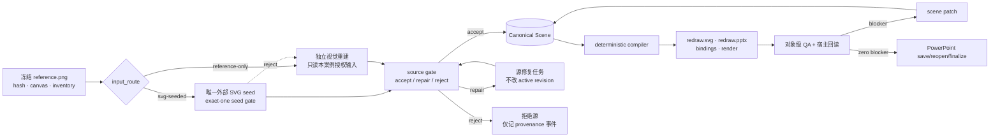
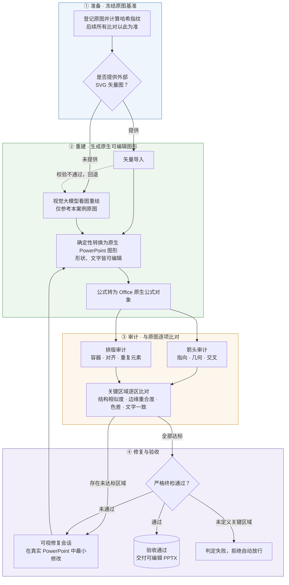

# Autofigure 架构（schema 4.0 当前实现）

## 0. schema 4.0：Y 型双路线与单一事实源

schema 4.0 是当前实现。两条输入路线只在源头分叉，通过 source gate 后必须合流到
**Canonical Scene**。下文涉及 v3.1 的内容只说明旧案例和旧字段如何迁移，不构成当前合同。



### 0.1 真实调度而非模式标签

- `input_route` 仍是建案后不可变的历史来源；它不决定合流后的编译器。
- `processing_mode` 是持久化的真实策略调度字段，只允许 `svg_import`、`svg_repair`、
  `png_reconstruct`。source gate 和显式 fallback 按当前决策写回它，后续源处理与 convert
  据此选择或拒绝分支；它不是只读展示标签，也不得改变 `input_route`。
- `reference-only` 的 seed gate 固定为 `forbidden`。`svg-seeded` 只能接收一个不可变
  `external-seed`；重复 seed、路线/参考哈希/画布冲突或危险内容直接拒绝。

### 0.2 source gate 与事务摄取

`qa/source-gate-report.json` 使用 schema `4.0.0`，对 route、seed 状态、candidate/reference
hash、canvas、raster image、unsupported SVG feature 和 semantic metadata 给出唯一决策：

- `accept`：允许规范化为 proposed Canonical Scene。
- `repair`：只生成有作用域的源修复任务；不改 `run.json`、`scene.json`、provenance
  candidate history 或当前交付物。
- `reject`：禁止构建，只在 append-only provenance 记录拒绝事件。被拒绝的外部 seed
  不得在同一案例中被另一 seed 替换；后续可在隔离读取清单下切换到
  `processing_mode=png_reconstruct`。

ingest 必须先把输入复制到 case-bound staging，校验完整 case/reference/base-scene/
scope 合同，再于隔离区干跑 normalize、compile 和结构预检。只有全部通过才能
通过单一 active-revision 指针原子提交；失败、崩溃或超时均不得留下半更新的
根目录事实。

### 0.3 Canonical Scene 与派生物

`scene.json` 是唯一构造事实源，必须完整表达稳定 ID、几何、样式、文字/公式、
z-order、语义角色和 topology。外部 seed 作为不可变 source evidence 保留，不得直接
覆盖 `redraw.svg`。

- `redraw.svg`、`redraw.pptx`、`render.png` 和 `bindings.json` 都是同一 scene revision
  的派生物，必须回读相同 `scene_sha256/revision_id/compiler_fingerprint`。
- schema 4.0 的 converter 始终从 Canonical Scene 编译；根 `redraw.svg` 仅作为派生物，
  不具备反向事实源地位。
- PowerPoint Live 修改只有在精确导出、校验并接受 `scene_patch` 后才能重建交付物。
  无法表达为 scene patch 的宿主变化必须 strict fail，禁止直接发布一份与 SVG/scene
  分叉的 PPTX。

### 0.4 语义图元规格

- `ArrowSpec`：单一逻辑箭头的 relation、path、routing/topology、body、start/end head、
  width/length 和 `single_visible_object=true`。
- `BraceSpec`：方向、端点、深度、双瓣、中央 cusp、笔画与 canonical path signature。
  旧 v3.1 案例中的 `primitive_spec(kind=brace)` 只可确定性迁移为 BraceSpec；under/left/right 只能由同一
  canonical generator 镜像/旋转。
- `AssetSpec`：稳定 asset ID、semantic kind、tight bbox、内部部件/交叉 topology、来源哈希、
  授权和可编辑性。DNA、图表、图标等可分解结构默认为原生矢量；只有明确授权且
  不可约的观测图才能使用紧边界 raster。
- `assets.json.policy + microasset_opportunity_map` 是 reference-bound 输入 oracle，必须显式存在并由
  `qa/asset-contract-receipt.json` 绑定 reference、冻结 inventory 与 canonical contract hash；转换器生成的
  `assets[]` 不进入该哈希，不能反向改写冻结真值。

### 0.5 对象级 QA 和四角色循环

QA 必须从 reference contract 穿透到 Canonical Scene、SVG/PPTX、宿主保存重开和最终
render。每个冻结对象都要有自己的 identity、bbox/ink、style/font、topology、z-order、
clearance/collision 和原生绑定证据；大面积白底 SSIM 不得代替小对象门禁。

每次构建都执行 **Designer → Drawer → Reviewer → Corrector**：Designer 仅从授权参考
冻结完整对象/关系/视觉合同；Drawer 产生 Canonical Scene；Reviewer 从新鲜派生物
和当前参考独立审计；Corrector 只返回有作用域、绑定 base-scene hash 的最小 scene
patch，然后全量重编译和重审。

通用代码、prompt 和 QA 中禁止以 case ID、文件名、截图坐标或某案例的 element ID
选择分支。一切特征必须由 schema/spec/capability 数据驱动；参考图特有坐标只能存在于
该案例合同中。修复必须增加 case-neutral 单元测试和未参与调优的 holdout 机制图验证，
不得以修好已知案例代替泛化证据。

## 1. 核心模型

旧设计把“输入来源”和“当前算法”混在 `source_mode` 中，导致案例 01 已回退 PNG 后看起来像从未使用过 Web SVG。v3.1 迁移首次将它拆成两个正交维度；当前 schema 4.0 延续该拆分：

| 字段 | 取值 | 生命周期 |
|---|---|---|
| `input_route` | `reference-only` / `svg-seeded` | 建案时显式指定，此后不可变 |
| `processing_mode` | `svg_import` / `svg_repair` / `png_reconstruct` | 真实策略调度；可随 source gate 或显式 fallback 改变 |

不变量：

1. `reference-only` 不等于“不能生成 SVG”，只表示没有用户提供的外部 SVG 种子。
2. `svg-seeded` 不绑定模型品牌。
3. SVG 被拒绝只改变 `processing_mode`；目录、`input_route` 和 provenance 不变。
4. 旧 v3 案例必须依据显式迁移表分类，禁止根据现有文件或当前模式猜测。

## 2. 总体流程

流程分四个阶段：准备 → 重建 → 审计 → 修复与验收。图中为面向读者的语义视图，命令与合同字段的精确对应见下方对照表。



| 阶段 | 命令 | 关键产物 |
|---|---|---|
| ① 准备 | `prepare` | `run.json`、`provenance.json`；输入路线（`input_route`）自此固定 |
| ② 重建 | `ingest` → `convert` → `math` | `redraw.pptx`、`bindings.json`；处理模式（`processing_mode`）允许回退 |
| ③ 审计 | `arrows` / `layout` / `check`（诊断档） | `check-report.md` 与 `qa/` 诊断数据 |
| ④ 修复与验收 | `repair` → `check`（严格档，须真实渲染证据） | 状态达 `approved` 方可交付 |

离线转换器以 SVG 作为完整初版的可渲染载体；无种子路线（`reference-only`）的视觉执行者可以是视觉大模型或人工。项目不声称在没有视觉推理的情况下自动理解任意科研图。

## 3. 案例目录

```text
examples/
├─ README.md
├─ route-comparison-<group>.json/.md
├─ reference-only/
│  └─ <globally-unique-case-id>/
└─ svg-seeded/
   └─ <globally-unique-case-id>/
```

每个案例根保持扁平：

```text
<case>/
├─ run.json
├─ provenance.json
├─ reference.png
├─ prompt.md
├─ redraw.svg
├─ redraw.pptx
├─ render.png
├─ preview.png
├─ check-report.md
├─ scene.json
├─ assets.json
├─ regions.json
├─ bindings.json
└─ qa/
```

命令可接收完整嵌套路径或全局唯一 case ID。旧 `examples/<case>/` 只兼容读取并警告，不创建副本或链接。

## 4. schema 4.0 合同

### `run.json`

- `schema_version=4.0.0`
- `task_mode=RECONSTRUCT_1TO1`
- 不可变 `input_route`
- 可变 `processing_mode`、`fidelity_profile`、`backend_mode`
- 参考相对路径、SHA-256、尺寸
- workflow 与最近一次 standard/strict validation 摘要

旧 v3.1 元数据只作为迁移输入。禁止保留 `source_abspath` 的权威地位；`source_mode`
只允许迁移读取，不能继续序列化。

### `provenance.json`

记录：参考图相对路径与哈希、外部 SVG 种子（可为 `null`）、候选历史、生成者/接口、时间、A/B `comparison_group`。未知模型明确为 `null` 或 `unknown`，不得猜测。

### 场景控制层

- `scene.json`：稳定对象 ID、语义、几何、层级、连接拓扑、`arrow_spec` / `primitive_spec` 和当前 PPTX artifact hash。
- `assets.json`：冻结的安全 policy/微资产机会图，以及与其分离的派生资产记录、来源、bbox、rights uncertainty、不可约理由、`editable`。
- `regions.json`：关键区域、对象范围、SSIM/Edge IoU、颜色探针、前景墨迹/净空合同、箭头物理视觉合同，以及参考图派生的闭世界 `reference_inventory`。
- `bindings.json`：scene element 到保存重开后的 shape ID/name、对象类型和后端证据。

## 5. 状态机

允许状态：`prepared / candidate / qa_failed / repairing / approved`。

- `prepare`：`prepared`，同时写入 required/draft inventory 骨架。
- `freeze`：先对 inventory 与显式资产机会图做无写入 preflight，再把 inventory 绑定到路线无关
  reference oracle（`examples/oracles/<reference_sha256 前 16 位>/oracle.json`；同参考图哈希在所有
  输入路线共享同一真值，已存在的 oracle 与新 inventory 不一致即拒绝，重授权须人工删除该 oracle 后
  重跑 freeze），再刷新 region tasks，并分别生成 inventory 与 asset-contract SHA-256 receipt
  （inventory receipt 以 `oracle_sha256` 绑定 oracle）；任一预检失败不得留下半冻结状态，状态仍为 `prepared`。
- `ingest`：新案例只接受已冻结且 receipt 未漂移的 inventory，成功后进入 `candidate`。
- strict 有 blocker：`qa_failed`。
- `repair`：`repairing`。
- strict 零 blocker：`approved`。

standard 永远只是诊断，不授予 approved。strict 没有 critical region 时必须添加 `regions:no-critical-regions`；strict 禁止跳过 OCR，必须验证 inventory receipt（oracle 存在时含 `oracle_sha256` 与 oracle 文件一致性）、asset-contract receipt 与精确文字闭合，并总是消费 PowerPoint Live finalizer 证据。不含 `reference_inventory` 的 legacy 案例保持可读，但不会为其伪造任何冻结 receipt。

## 6. 箭头与布局

两条输入路线只生成统一 `ArrowSpec`，确定性编译器再选择单一 PowerPoint 对象：直线 line、真实附着 connector、固定 polyline/cubic freeform，或单一闭合块箭头 freeform。相同 ArrowSpec 的编译策略必须相同。

旧“杆＋独立箭头头＋group”只允许生成 standard 诊断预览，并必须写入 `fidelity_loss`；strict 对 `arrow-group`、`arrowhead-fallback` 或一个逻辑箭头多个可见对象直接失败。PowerPoint Live 只有通过 [箭头能力规格](POWERPOINT_ARROW_CAPABILITY_SPEC.md) 的哈希绑定矩阵探针后才允许创作箭头。

brace 使用同级 `primitive_spec` 和唯一 `brace_v1`：under/left/right 只能由 canonical over/under 基式镜像或旋转得到。strict 独立检查双瓣、中央 cusp、两子路径和单一可编辑 PowerPoint freeform。

箭头审计以被指向形状的边缘为目标边界（箭头自身路径不计入），并检查目标身份、transform、端点、中心线 P95、切线角、交叉和标签碰撞。校准以逐箭头 ID 为单位，并且必须来自当前参考哈希绑定的像素/明确测量证据；头部 bbox、物理宽长及障碍物净空与 PowerPoint 端点枚举读回分别门禁。

布局合同：

- 容器文字/公式使用 `data-layout-container` 与 padding。
- 重复图元使用 `data-repeat-group/data-repeat-axis/data-repeat-order`。
- source SVG 与保存重开的 PPTX 分别检查；默认容器/同轴/尺寸漂移 ≤0.25 px，相邻中心距范围 ≤1 px。
- 小目标用 tight-region `ink_contract` 约束前景 bbox、中心和面积；彩色 caption 用带明确 subject/obstacle bbox 的 `color_clearance_contracts` 逐目标保持相对参考图的最小空白距离，并检查目标存在性与几何。critical 阈值不得低于 SSIM 0.85 / Edge IoU 0.75。
- `critical_region_expectation`、`primitive_expectations` 和 `arrow_visual_expectation` 分别冻结关键区、语义图元与箭头视觉合同的完整清单。

## 7. 微资产

正式结构必须原生。只有用户明确授权、无法忠实分解且紧边界的微资产允许从当前案例 `reference.png` 裁剪。PowerPoint shape Tags 持久化 asset ID、源哈希、紧边界声明、不可约原因与 `editable=false`。

真实 ModularAgent reference-only A/B 已证明 observation 和 environment globe 两个裁剪区能达到 SSIM/Edge IoU 1.0；这不为其余区域背书。

## 8. PowerPoint Live

离线先生成初版，只对失败区域启动托管可见会话。bridge 在 `qa/powerpoint-live-case/` 中将 Autofigure 场景适配为服务端 Scene 2.1；正式 `scene.json` 仍是源事实。

live 必须显式 case、session、revision 和幂等键，支持 inspect、audit、save/reopen、render 和 object binding。离线包重开只记录 `package_reopened=true`；只有正式根 PPTX、bindings、Live candidate、reopened artifact 与 OOXML readback 五方哈希闭合后才能记录 `saved_reopened=true`。自动状态最多为 `INDEPENDENT_REVIEW_REQUIRED`，没有 release authority。

保存重开成功但没有区域修复结果时，只能记录 backend diagnostic；不能伪造 `live-evidence.json`，strict 仍保留 `live-evidence-missing`。

## 9. 案例治理与项目卫生

```bat
autofigure cases --write-index
autofigure cases --check
autofigure compare <svg-seeded-case> <reference-only-case>
autofigure hygiene
```

`cases --check` 验证路线目录、全局 ID、合同、参考哈希、索引和可移植路径。`compare` 要求相同参考哈希、不同路线、相同非空 comparison group，并报告对象数、可编辑文字/公式/箭头、区域 SSIM/Edge IoU/ΔE00、箭头发现、全图诊断和最终状态。`hygiene` 对全仓 markdown 做交付物负面回声扫描（对照式修复叙事、对旧实现的批评等），合同性约束与工具指引行豁免；修复过程与防重复踩坑教训必须写入 `history/` ADR。

## 10. 插件 provider 边界

统一协议：`discover / health / capabilities / execute / inspect / undo`。原生 PowerPoint provider 最高优先级。第三方插件只有在提供独有、结构化、可回读、幂等且可撤销能力时才可进入。

OneKeyTools10 仅隔离试点；iSlide/ThreeD Tools 按需；其余排除。禁止 Ribbon 坐标点击、SendKeys 和图像识别点击。
