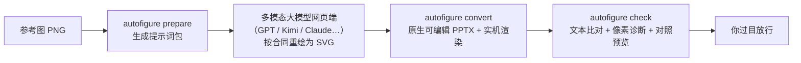

<p align="center"><strong>简体中文</strong> ｜ <a href="README_EN.md">English</a></p>

# AI AutoFigure · autofigure2PPT

**把科研论文插图（PNG）变成真正可编辑的 PowerPoint——文字能改、公式能继续编辑、照片零失真。**

[](LICENSE)
[](requirements-v2.txt)
[](#-faq)
[](examples/README.md)

论文里的架构图、流程图很好看，但只要是图片就改不动——投稿返修要改个模块名、做组会汇报想换个配色，都只能求原图或者拿形状硬描。AI AutoFigure 把这件事变成一条流水线：**多模态大模型看图重绘，工具链确定性地转换成原生 PPTX 对象并自动核验**，你最后过目放行。

## 🎬 效果展示

三张对照图均为「上：论文原图 ｜ 下：交付 PPTX 的 PowerPoint 原生渲染」。

| 案例（均为 CVPR 2026 论文图） | 尺寸 | 原生对象 | 文本框 | OMML 公式 | mean↓ | SSIM↑ | changed↓ |
|---|---|---:|---:|---:|---:|---:|---:|
| 01 ModularAgent | 1429×627 | 243 | 66 | **22** | 16.62 | 0.733 | 38.27% |
| 02 Thinking Diffusion | 1513×554 | 162 | 46 | — | 13.55 | 0.720 | 17.97% |
| 03 LLMind | 1357×656 | 201 | 34 | **6** | **6.87** | **0.868** | **12.97%** |

### 01 · ModularAgent — 最复杂的一张

GPT 网页端直出 + 第二圈自批评修订（箭头实心化贴原图、照片原子裁剪）+ 箭头结构确定性修复（42 处锚点归零、曲线箭头按末端切线对齐、金色箭头头长按原图实测校准）。243 个原生对象全部可编辑，22 个公式（𝔼、∇、上下标等）升级为原生 Office Math。


### 02 · Thinking Diffusion — 换个模型照样跑

由 Kimi 按输出合同手写 SVG 完成，文本比对 0 条未匹配——证明「换模型不换工具」。


### 03 · LLMind — 像素指标最佳

GPT 直出，两张照片从原图像素级裁剪嵌回，mean / SSIM / changed 三项均为三案例最优。


> **关于指标**：mean / SSIM / changed 是「渲染与原图有多像」的诊断软信号，不是验收门禁；本项目的验收标准是**文字 100% 可编辑读回 + 人审对照图**。01 / 03 的指标为公式升级为原生 Office Math 之后的口径（较文本框版本微升，换来公式可编辑性）。对照已归档的 v1 重型确定性管线（4 天 / ~30 轮 / 27k LOC）：mean 19.9987 / SSIM 0.6535 / changed 46.55%（见 `legacy/`）。
>
> 每个案例目录里就是交付物本身：`redraw.pptx` 可直接用 PowerPoint / WPS 打开编辑。

## ✨ 特性

- **✏️ 文字 100% 可编辑** —— 每个字都是 PowerPoint 原生文本框，双击就改，不是贴图、不是路径描摹。
- **🧮 公式原生 Office Math** —— 上下标、希腊字母、𝔼/∇ 等公式批量升级为 OMML 原生公式对象，可继续在 PowerPoint 公式编辑器里编辑。
- **🖼️ 照片零失真** —— 照片、截图等写实区域由工具从**你的原图**按坐标像素级裁剪嵌入，绝不让 AI「画照片」。
- **🔁 模型随便换** —— GPT、Kimi、Claude……任何能看图的多模态大模型网页端都行。工具链只认输出合同，不认厂商。
- **🔍 自带核验报告** —— 每次转换自动生成文本比对 + 像素诊断 + 上原图下渲染的对照预览，人审放行而非黑盒交付。
- **📦 开箱即交付** —— 产物是标准 `.pptx`，不需要任何插件或特殊环境就能打开继续编辑。

## 🔧 工作原理（30 秒版）

分工很朴素：**AI 擅长看图，工具擅长一丝不苟**。多模态大模型负责把参考图重绘成守合同的 SVG；本工具链负责确定性地转换、核验，全程不猜、不糊弄。



### 质量如何保证

你不需要读技术合同也能放心用，因为工具在替你把关：

- **为什么文字一定可编辑**：工具只接受「文字逐字写成文本元素」的 SVG，把字画成路径的直接拒收；转换后再做一次全量文字读回校验。
- **为什么公式还能再编辑**：`math` 命令把上下标公式升级为 PowerPoint 原生公式对象（OMML），双击进入的是熟悉的公式编辑器。
- **为什么照片不走样**：合同规定写实区域必须占位标注，由转换器从原图裁剪嵌入原图像素——AI 无权替你「重画」一张照片。
- **为什么版式不会跑偏**：画布尺寸必须与原图像素一一对应，箭头粗细、头部样式、弯折均以原图为准，不接受模板化风格。
- 完整技术合同见 [`references/v2-prompt-contract.md`](references/v2-prompt-contract.md)。

## 🚀 快速开始

### 你需要准备

- 一台 **Windows** 电脑，装有 **PowerPoint**（实机渲染与公式注入通过本机 Office 完成）
- **Python 3.12**
- 任一**多模态大模型**的网页访问（GPT / Kimi / Claude…，免费额度通常就够一张图）
- 一张论文插图 **PNG**

### 安装（一次性）

```bat
python -m venv .venv
.venv\Scripts\pip install -r requirements-v2.txt
```

### 四步拿到可编辑 PPTX

在项目根目录打开命令行，逐条执行；每一步都会明确告诉你得到了什么：

```bat
REM ① 生成案例目录 + 提示词包
autofigure prepare 我的图.png --case 01-my-figure
```
→ 得到 `examples\01-my-figure\prompt.md`（一份写好输出合同的提示词）。

```bat
REM ② 唯一的"人工"步骤：把提示词发给大模型
```
→ 打开你顺手的多模态大模型网页端，把 `prompt.md` 全文 + 原图一起发过去；把返回的 SVG 保存为 `examples\01-my-figure\redraw.svg`。就是复制粘贴。

```bat
REM ③ 转换 + 实机渲染
autofigure convert examples\01-my-figure
```
→ 得到 `redraw.pptx`（★ 交付物，原生可编辑）和 `render.png`（PowerPoint 实际渲染效果）。

```bat
REM ④ 核验 + 对照预览
autofigure check examples\01-my-figure
```
→ 得到 `check-report.md`（文本比对 + 像素诊断）和 `preview.png`（上原图、下渲染）。过目无误即交付。

```bat
REM 可选：把公式升级为原生 Office Math
autofigure math examples\01-my-figure
```
→ 公式文本框（上下标 / 斜体短公式）批量变为可再编辑的原生公式对象；`--dry-run` 只检测不改文件。

```bat
REM 可选：箭头结构审计 / 确定性几何修复（改后需重跑 convert → math → check）
autofigure arrows examples\01-my-figure --fix
```
→ 审计箭头锚点 / 头线比例 / 端点悬空并汇入 check 报告；`--fix` 只动几何不动样式，`--clamp-ratio` 头长限幅，`--calibrate ID=LEN` 按原图实测校准头长。

## ❓ FAQ

<details>
<summary><b>必须是 Windows + PowerPoint 吗？</b></summary>

实机渲染（render）与公式注入（math）通过本机 Office COM 驱动，目前要求 Windows + 已安装 PowerPoint。但产物 `.pptx` 是标准格式，macOS / Linux 上用 PowerPoint、WPS、Keynote 打开编辑都没问题。
</details>

<details>
<summary><b>我该用哪个大模型？</b></summary>

任何一个能看图、能输出 SVG 的多模态大模型网页端都行。案例 01 / 03 用 GPT，案例 02 用 Kimi，效果都达标——工具只校验输出是否守合同，与厂商无关。模型越强，一次过的概率越高。
</details>

<details>
<summary><b>check 里的 OCR 会动我电脑里的东西吗？</b></summary>

不会。OCR 只对参考图做一次**只读**取字，用来比对文字有没有漏画、错画；不联网、不写任何文件。没配置 OCR 环境时，check 的像素诊断与对照预览照常可用。
</details>

<details>
<summary><b>照片、截图这类写实内容会被 AI 画走样吗？</b></summary>

不会。合同规定写实区域必须占位，由转换器从原图按坐标像素级裁剪嵌入——嵌入的就是你原图里的像素，一张都不会差。
</details>

<details>
<summary><b>指标表里的 mean / SSIM 是什么？不达标会怎样？</b></summary>

它们衡量「渲染结果与原图有多像」，只是诊断软信号。工具不用它们自动放行或拦截——验收标准始终是文字 100% 可编辑读回 + 你本人看对照图认可。
</details>

<details>
<summary><b>和直接截图贴进 PPT 有什么区别？</b></summary>

截图是死的：改不了字、换不了色、挪不了模块。本项目产出的是原生 PowerPoint 对象——改文字、调颜色、删元素、重组布局，都和编辑普通 PPT 一样。
</details>

## 📄 License

[MIT](LICENSE) © 2026 let778750-cpu

## 📚 深入了解（开发者向）

| 文档 | 内容 |
|---|---|
| [`SKILL.md`](SKILL.md) | 正式操作指令与不可突破红线 |
| [`PROJECT_ARCHITECTURE.md`](PROJECT_ARCHITECTURE.md) | 全流程架构（prepare / convert / check / math 分节展开） |
| [`references/v2-prompt-contract.md`](references/v2-prompt-contract.md) | VLM 输出合同全文 |
| [`examples/README.md`](examples/README.md) | 案例索引与产物文件约定 |
| [`legacy/`](legacy/) | v1 重型确定性管线归档（2026-08-18 起不维护；math 命令复用其公式引擎） |

开发与测试（46 个测试，全部离线可跑）：

```bat
.venv\Scripts\python -m pytest tests\v2 -q
.venv\Scripts\python -m ruff check tools\v2 tests\v2
```

运行环境：v2 全部命令在项目内 `.venv`（依赖见 `requirements-v2.txt`）；check 的 OCR 比对使用独立的 PaddleOCR 只读环境（配置锁定 `legacy/ocr-config.json`）；实机渲染走本机 PowerPoint COM。
