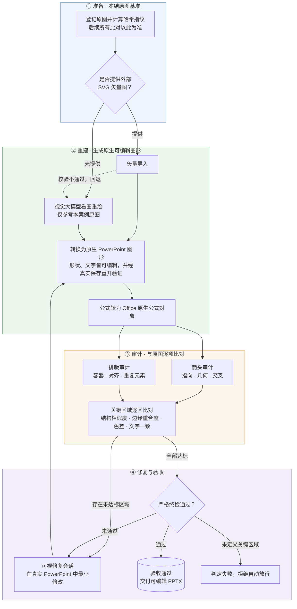

<p align="center"><strong>简体中文</strong> ｜ <a href="README_EN.md">English</a></p>

# AI AutoFigure · autofigure2PPT

把科研图 PNG 重建为原生可编辑 PowerPoint，并以参考哈希、对象绑定、局部指标和 PowerPoint 保存重开证据约束质量。

> 当前事实：项目已真实跑通 `reference-only` 与 `svg-seeded` 两条输入路线，但 ModularAgent 的两条路线都仍是 `qa_failed`。**管线跑通不等于一比一质量成熟，任何关键区失败都不得写成完成。**

## 总体流程



## 两条输入路线

v3.1 把过去混在 `source_mode` 里的两个维度拆开：

| 维度 | 取值 | 语义 |
|---|---|---|
| `input_route` | `reference-only` / `svg-seeded` | 建案时的输入来源；创建后不可变 |
| `processing_mode` | `svg_import` / `svg_repair` / `png_reconstruct` | 当前处理方法；失败回退时可变 |

- `reference-only`：用户没有提供外部 SVG 种子。执行者仍可从 PNG 生成内部 SVG，作为离线转换载体；它在 provenance 中是 reconstruction candidate，不是 external seed。
- `svg-seeded`：历史上存在外部 SVG 种子，不绑定 GPT，也可以来自 Kimi、Claude、Codex 或人工。SVG 被拒绝后只改变 `processing_mode`，不会改变目录或 `input_route`。

## 案例展示

按输入路线分两类，各展示案例 01。对照图中**上为原图、下为重建渲染**；两案例使用同一张冻结参考图，指标与状态如实标注。

### 一 · 提供外部 SVG 重绘（svg-seeded）


[`01-modular-agent`](examples/svg-seeded/01-modular-agent/)（ModularAgent 架构图，196 个绑定对象全部经保存重开验证）：

| 指标 | 值 |
|---|---|
| 绑定对象 / 可编辑文字 / 原生公式 | 196 / 44 / 22 |
| 可编辑箭头对象 / 箭头审计发现 | 46 / **0** |
| 关键区域通过 | 2/6 |
| 状态 | `qa_failed`（4 个区域 blocker + live 证据缺失） |

机器证据：[QA_STATUS.md](examples/svg-seeded/01-modular-agent/QA_STATUS.md) · [check-report.md](examples/svg-seeded/01-modular-agent/check-report.md)

### 二 · 仅提供目标 PNG 重绘（reference-only）


[`01-modular-agent-reference-only`](examples/reference-only/01-modular-agent-reference-only/)（同一参考图的独立重建，全程未读取上一案例的 SVG、PPTX、场景、绑定或坐标）：

| 指标 | 值 |
|---|---|
| 绑定对象 / 可编辑文字 / 原生公式 | 188 / 45 / 22 |
| 可编辑箭头对象 / 箭头审计发现 | 43 / **72** |
| 关键区域通过 | 2/6（通过的两区为授权微资产，SSIM/Edge IoU 均为 1.0） |
| 状态 | `qa_failed` |

机器证据：[check-report.md](examples/reference-only/01-modular-agent-reference-only/check-report.md)

两路线对照结论：提供 SVG 种子时箭头结构可做到零审计发现；仅有 PNG 时管线同样走通，但箭头质量差距（72 处发现）是当前主要短板。受控 A/B 报告见 [`route-comparison-modular-agent-route-ab.md`](examples/route-comparison-modular-agent-route-ab.md)。

`02-thinking-diffusion` 与 `03-llmind` 仅有 standard 诊断（`candidate`，无关键区定义），未达展示门槛；完整案例索引见 [`examples/README.md`](examples/README.md)。

## 能做什么，不能做什么

- 文字、公式、规则节点和箭头转为原生可编辑对象；公式可升级为 Office Math。
- 普通直线箭头优先使用 PowerPoint connector；曲线保留 freeform 路径；无法原生表达的 marker 必须显式回退并分组。
- 经用户授权且不可约的 observation、照片、小地球等微资产可从**本案例自己的** `reference.png` 紧边界裁剪，标记 `editable=false`。禁止整图贴图或用位图冒充文字、公式、节点和拓扑。
- PowerPoint Live 可以打开可见托管画布、检查对象、审计、保存重开和回读。它不会自动证明视觉区域通过，也没有自行放行权限。
- PNG-only 入口已经通过真实科研图全链路，但当前结果表明视觉重建质量仍依赖视觉执行者与迭代修复，不能宣传成“无模型自动一比一”。

## 快速开始

要求：Windows、Microsoft PowerPoint、Python 3.12。第三方 PowerPoint 插件不是核心依赖。

```bat
python -m venv .venv
.venv\Scripts\pip install -r requirements.txt
```

### 路线 A：用户提供外部 SVG 种子

```bat
autofigure prepare reference.png --case my-case --input-route svg-seeded
autofigure ingest my-case candidate.svg --kind svg --candidate-role external-seed --candidate-origin web-vlm
autofigure convert my-case
autofigure math my-case
autofigure check my-case --profile standard
```

如果 SVG 被拒绝：

```bat
autofigure ingest my-case --rejected --fallback png_reconstruct
```

案例仍位于 `examples/svg-seeded/my-case/`，仅 `processing_mode` 改为 `png_reconstruct`。

### 路线 B：只有 PNG

```bat
autofigure prepare reference.png --case my-direct-case --input-route reference-only
```

这会生成 `qa/region-tasks.json`。由 Codex、其他 VLM 或人工仅依据该案例的 `reference.png` 生成候选，再摄取：

```bat
autofigure ingest my-direct-case candidate.svg --kind svg --candidate-role reconstruction-candidate --candidate-origin codex
autofigure convert my-direct-case
autofigure math my-direct-case
autofigure check my-direct-case --profile strict --require-live
```

未提供 `--input-route` 会直接报错。旧 `--source-mode` 只保留一版弃用兼容，不能代替路线，也不得据此推断历史来源。

## 严格质量门禁

- 状态：`prepared → candidate → qa_failed/repairing → approved`。
- `approved` 只能由 strict 零 blocker 写入。
- 默认关键区：SSIM ≥ 0.85、Edge IoU ≥ 0.75；授权位图微资产 SSIM ≥ 0.95；颜色探针使用 ΔE00。
- 全图 mean/SSIM/changed 只作报告，不得覆盖任一局部失败。
- strict 没有关键区时添加 `regions:no-critical-regions`，禁止“零关键区自动通过”。
- hybrid 任务缺少真实 live 区域证据时保留 `live-evidence-missing`。

```bat
autofigure repair my-case
autofigure check my-case --profile strict --require-live
```

## 合同与可移植性

每个案例有 `run.json`、`provenance.json`、`scene.json`、`assets.json`、`regions.json`、`bindings.json`。正式身份使用案例内相对路径和 SHA-256，不以某台电脑的 `source_abspath` 为权威。

```bat
autofigure cases --write-index
autofigure cases --check
autofigure compare 01-modular-agent 01-modular-agent-reference-only
autofigure hygiene
```

## PowerPoint 与第三方插件

默认只要求 Microsoft PowerPoint、`powerpoint-live` MCP 和 Autofigure 自身转换/QA。OneKeyTools10 仅保留为隔离环境试点候选；iSlide 是可选人工素材源；ThreeD Tools 只在明确三维案例后评估；其余美化、动画类插件不进入自动化主流程。禁止使用 Ribbon 坐标点击、SendKeys 或图像识别点击作为生产 MCP。

## 开发验证

```bat
.venv\Scripts\python -m pytest tests -q
.venv\Scripts\python -m ruff check tools tests
.venv\Scripts\python -m compileall -q tools tests
autofigure cases --check
autofigure hygiene
```

更多细节见 [`PROJECT_ARCHITECTURE.md`](PROJECT_ARCHITECTURE.md)、[`HIGH_FIDELITY.md`](HIGH_FIDELITY.md)、[`SKILL.md`](SKILL.md) 和 [`examples/README.md`](examples/README.md)。

## License

[MIT](LICENSE) © 2026 let778750-cpu
