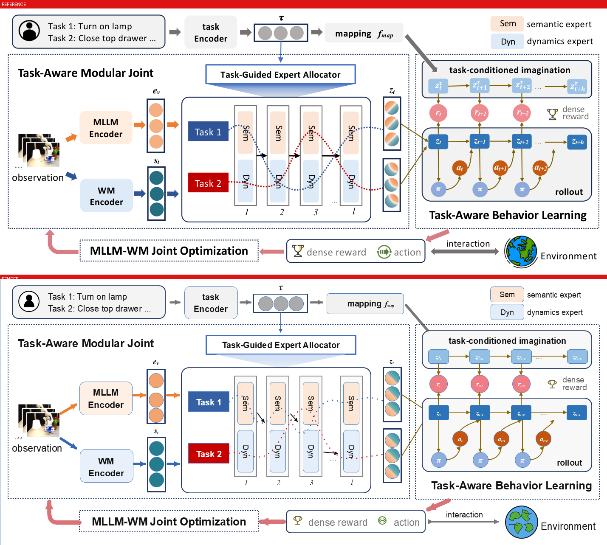
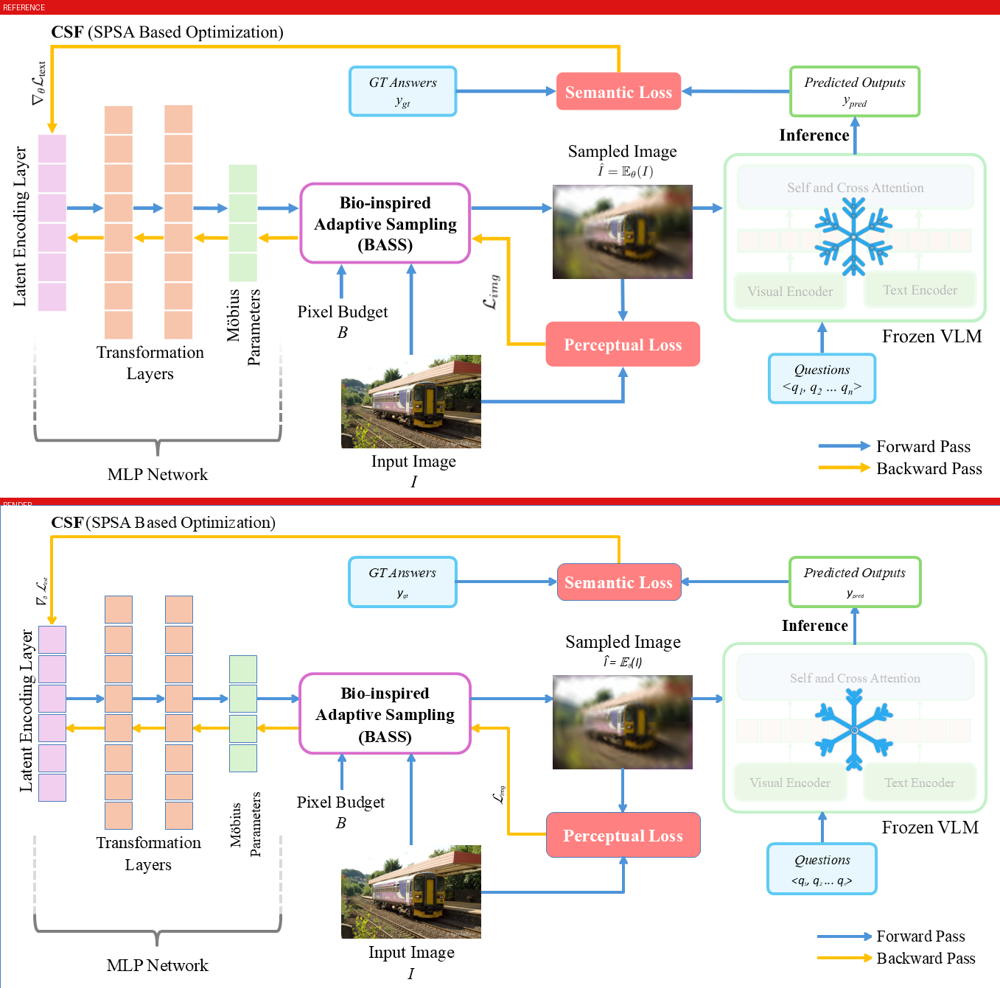
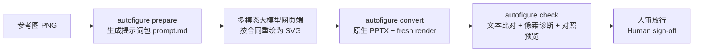

# AI AutoFigure · autofigure2PPT

**把科研论文插图（PNG）高保真重建为原生可编辑 PowerPoint**
**Rebuild research-paper figures (PNG) into native, fully editable PowerPoint.**

## 项目简介 | Overview

**中文**：架构为 **VLM-first, verify-light**——多模态大模型（GPT / Kimi / Claude 等）负责看图，把参考图重绘为 SVG；本工具负责确定性执行：把 SVG 转换为原生 PPTX 对象（文字 100% 原生文本框可编辑读回、公式保留上下标、无文字写实区域从原图原子裁剪嵌入），再用轻量核验（文本比对 + 像素诊断 + 对照预览）支撑人审放行。模型可任意替换——工具链只认输出合同，不认厂商。

**English**: **VLM-first, verify-light.** A multimodal LLM (GPT / Kimi / Claude, etc.) does the seeing and redraws the reference figure as SVG. This tool does the deterministic rest: it converts the SVG into native PPTX objects (100% of text is native, read-back editable; formula sub/superscripts preserved; text-free realistic regions atomically cropped from the source image), then light verification (text diff + pixel diagnostics + side-by-side preview) backs a human sign-off. The model is interchangeable — the toolchain trusts the output contract, not the vendor.

## 案例展示 | Showcase

每幅对照图：上为论文原图，下为交付 PPTX 的 PowerPoint 原生渲染。
Each preview: top = original paper figure, bottom = native PowerPoint render of the delivered PPTX.

| 案例 Case | 原生对象 Shapes | 文本读回 Texts | mean↓ | SSIM↑ | changed↓ |
|---|---:|---:|---:|---:|---:|
| 01 ModularAgent (1429×627) | 243 | 66 | 16.57 | 0.735 | 38.27% |
| 02 Thinking Diffusion (1513×554) | 162 | 46 | 13.55 | 0.720 | 17.97% |
| 03 LLMind (1357×656) | 201 | 34 | **6.77** | **0.870** | **12.90%** |

> 指标为 `figure_lint` 诊断口径（软信号，非门禁）；验收 = 文本读回 + 人审。
> Metrics are advisory diagnostics, not gates; acceptance = text read-back + human review.
> 对照 v1 重型确定性管线（4 天 / ~30 轮 / 27k LOC）：mean 19.9987 / SSIM 0.6535 / changed 46.55%，已归档 `legacy/`。
> vs. the archived v1 heavyweight deterministic pipeline (4 days / ~30 rounds / 27k LOC): 19.9987 / 0.6535 / 46.55%.

### 01 · ModularAgent（GPT 直出 SVG + 第二圈自批评修订：箭头实心化贴原图、照片 atomic 裁剪）



### 02 · Thinking Diffusion（Kimi 按合同手写 SVG → PPTX，文本比对 0 未匹配）


### 03 · LLMind（GPT 直出，`<image>` 自动容错为原图裁剪；两张照片像素级嵌回）



交付的 `.pptx` 位于各案例目录，可直接打开编辑。
The delivered editable `.pptx` files live in each case directory and open directly in PowerPoint.

## 工作流程 | Workflow



1. **prepare**：建案例目录、生成提示词包（含原图尺寸与输出合同）。
2. **VLM（人工搬运）**：把 prompt + PNG 发给多模态大模型网页端，取回 `redraw.svg`。
3. **convert**：SVG → 原生可编辑 PPTX + PowerPoint COM fresh render，并读回统计（对象数/文本框数）。
4. **check**（全部 advisory）：SVG 文字 vs 原图 OCR 比对、figure_lint 像素诊断、对照预览，汇总 `check-report.md` 供人审。

1. **prepare**: create the case directory and the prompt package (image size + output contract).
2. **VLM (manual step)**: send prompt + PNG to a multimodal LLM web app; save the result as `redraw.svg`.
3. **convert**: SVG → native editable PPTX + fresh render via PowerPoint COM, with read-back statistics.
4. **check** (all advisory): SVG text vs. source-image OCR diff, pixel diagnostics, side-by-side preview → `check-report.md` for human review.

## 快速开始 | Quick Start

```bat
REM 首次 | First time
D:\anaconda\python.exe -m venv .venv
.venv\Scripts\pip install -r requirements-v2.txt

REM 四步 | Four steps
autofigure prepare <参考图.png> --case 01-my-figure
REM   → 把 prompt.md 全文 + PNG 发给多模态大模型网页端，SVG 存为 examples\01-my-figure\redraw.svg
autofigure convert examples\01-my-figure
autofigure check   examples\01-my-figure
```

## 输出合同要点 | Output Contract Highlights

完整合同见 `references/v2-prompt-contract.md` | Full contract: `references/v2-prompt-contract.md`

- `viewBox` 必须等于原图像素尺寸，不符即拒 | viewBox must equal source pixels; mismatches are rejected.
- 文字逐字 `<text>`/`<tspan>`，禁止画成路径 | verbatim text as `<text>`/`<tspan>`; text-as-path is forbidden.
- 公式斜体 + `baseline-shift` 上下标 | italic variables + baseline-shift sub/superscripts.
- 箭头粗细/头部样式/弯折以原图为准，禁止套用固定风格 | arrows must match the original's weight/head-style/bends; no one-size-fits-all style.
- 无文字写实元素用 `<rect id="atomic:*">` 占位，convert 从原图裁剪嵌入；含文字/公式内容与几何元素禁止占位；`<image>` 容错按 bbox 裁剪替代（覆盖画布 ≥50% 拒绝） | text-free realistic regions use `atomic:` placeholders cropped from the source; text/formula/geometry may not be rasterized; `<image>` is tolerated as a bbox crop (rejected at ≥50% canvas).

## 环境 | Environment

| 用途 Purpose | 运行时 Runtime |
|---|---|
| v2 全部命令 + 测试 | 项目内 `.venv`（依赖见 `requirements-v2.txt`） |
| check 的 OCR 文本比对（只读单次调用） | 独立 PaddleOCR 环境（配置锁定 `legacy/ocr-config.json`） |
| fresh render | 本机 PowerPoint COM（pywin32 直驱） |

## 测试 | Tests

```bat
.venv\Scripts\python -m pytest tests\v2 -q
.venv\Scripts\python -m ruff check tools\v2 tests\v2
```

## 文档 | Documentation

- `SKILL.md` — 正式工作指令与红线 | operating instructions & red lines
- `PROJECT_ARCHITECTURE.md` — 全流程架构（mermaid）| full pipeline architecture
- `references/v2-prompt-contract.md` — VLM 输出合同 | VLM output contract
- `examples/README.md` — 案例索引 | case index
- `legacy/` — v1 重型管线归档（2026-08-18），不维护 | archived v1 pipeline, unmaintained
