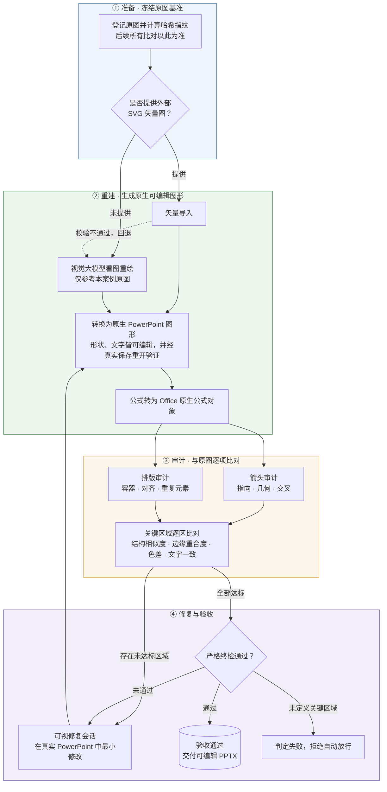
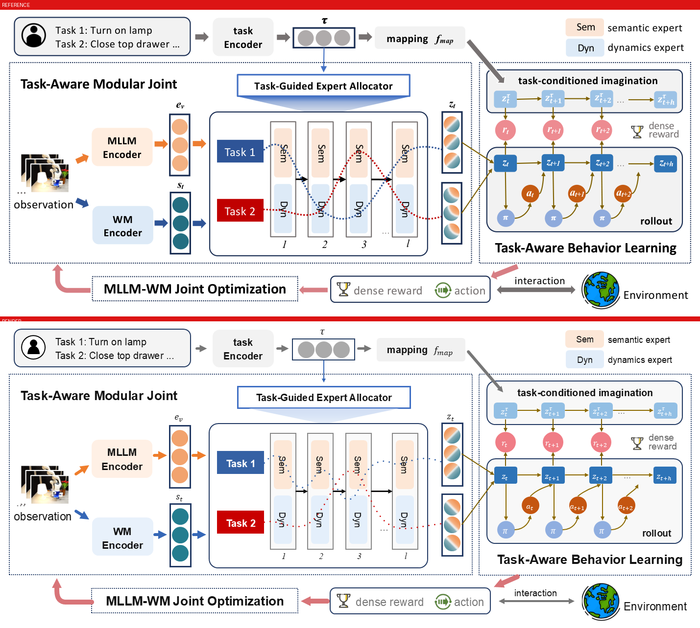
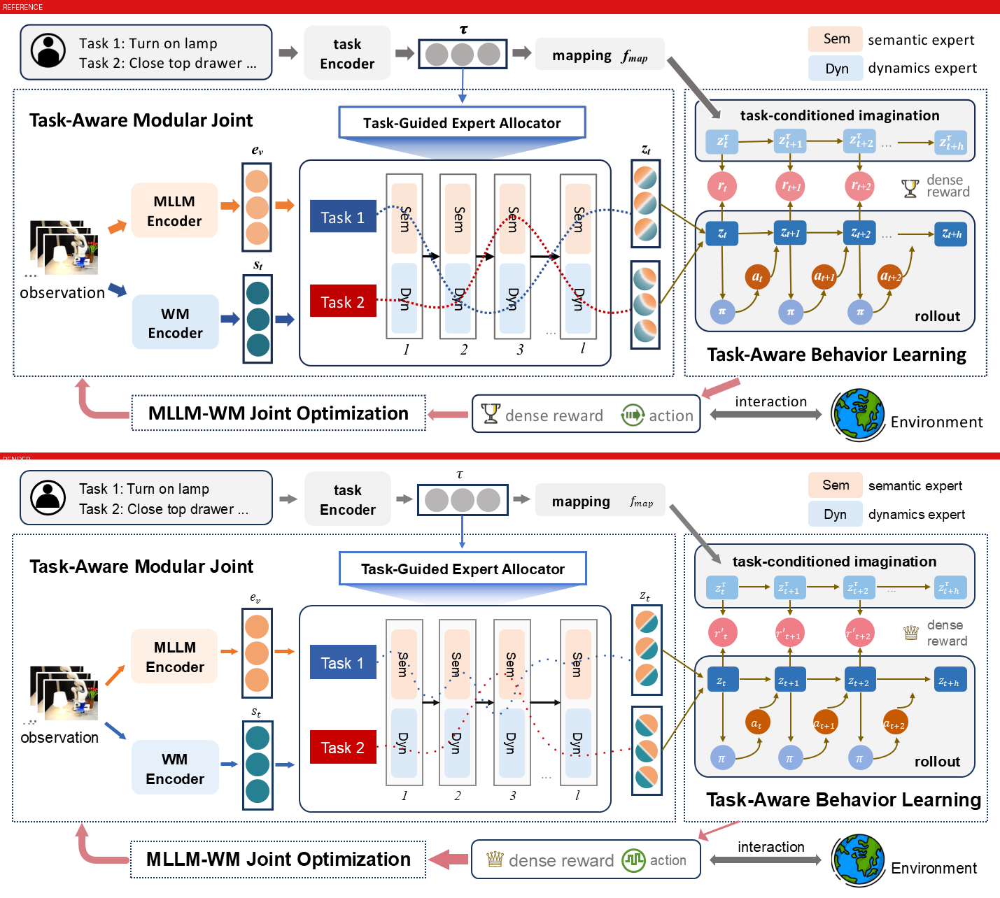
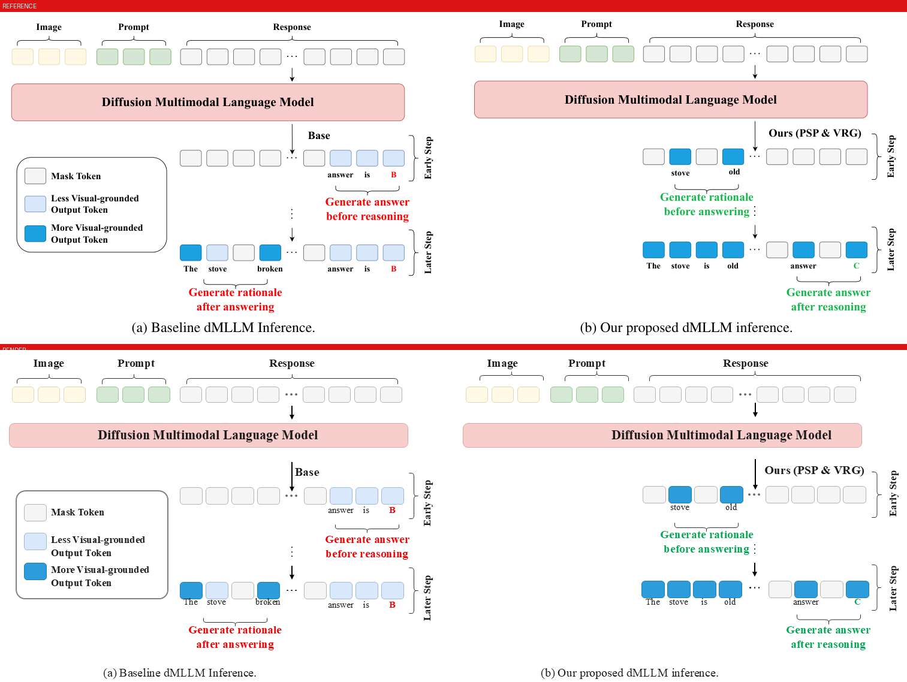
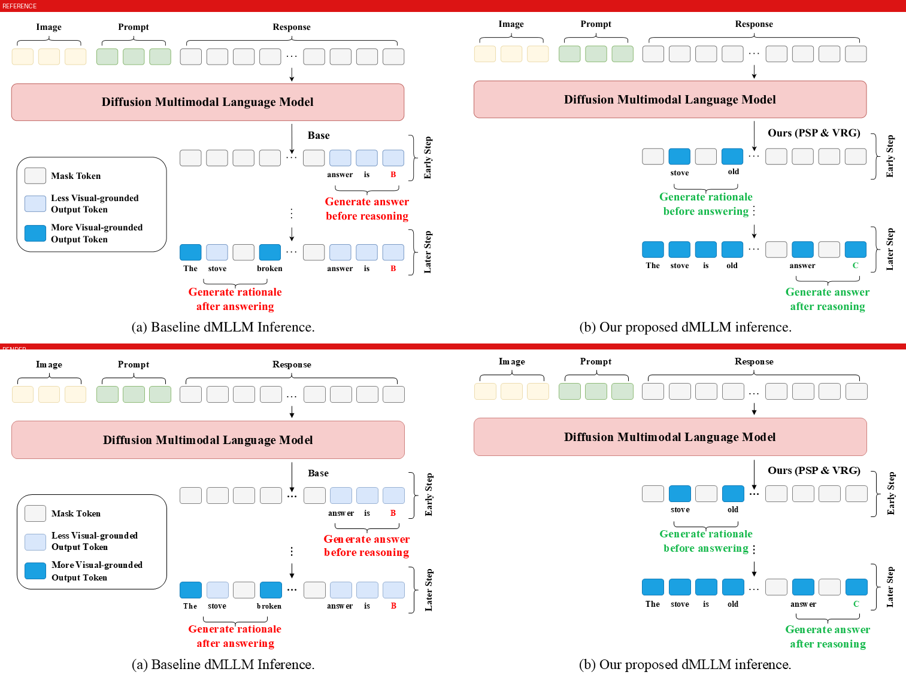
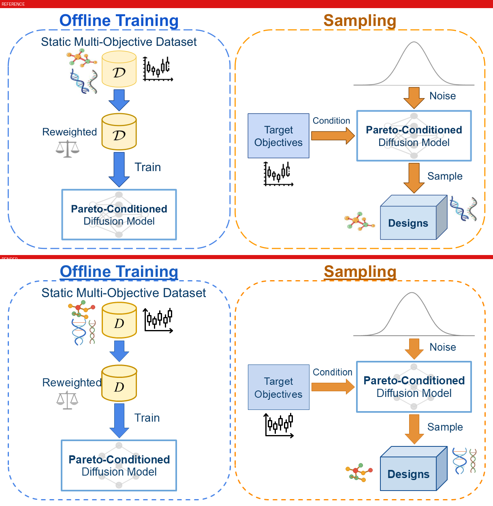
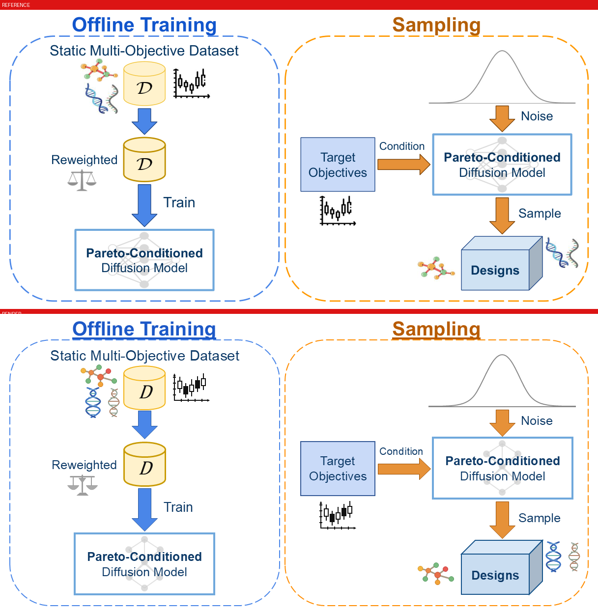

<p align="center"><strong>简体中文</strong> ｜ <a href="README_EN.md">English</a></p>

# AI AutoFigure · autofigure2PPT

把科研图 PNG 重建为原生可编辑 PowerPoint，并以参考哈希、对象绑定、局部指标和 PowerPoint 保存重开证据约束质量。

> 当前事实：schema 4.0 下，`reference-only` 与 `svg-seeded` 两条输入路线已在三个真实科研图主题（ModularAgent、Thinking Diffusion、Pareto-Conditioned Diffusion）共 7 个案例上全链路跑通，但**所有案例仍是 `qa_failed`**。其中 svg-seeded 的 Thinking Diffusion 已通过全部 18 个关键区域和箭头物理门禁，只差保存重开与 Live 证据链闭合。**管线跑通不等于一比一质量成熟，任何关键区失败或证据缺失都不得写成完成。**

## 总体流程



## 两条输入路线

当前实现采用 schema 4.0。v3.1 只作为旧元数据的迁移背景：该次迁移把过去混在
`source_mode` 里的两个维度拆开，schema 4.0 延续这一合同：

| 维度 | 取值 | 语义 |
|---|---|---|
| `input_route` | `reference-only` / `svg-seeded` | 建案时的输入来源；创建后不可变 |
| `processing_mode` | `svg_import` / `svg_repair` / `png_reconstruct` | 当前源处理策略的真实调度字段；source gate 或显式 fallback 可变更 |

- `reference-only`：用户没有提供外部 SVG 种子。执行者仍可从 PNG 生成内部 SVG，作为离线转换载体；它在 provenance 中是 reconstruction candidate，不是 external seed。
- `svg-seeded`：历史上存在外部 SVG 种子，不绑定 GPT，也可以来自 Kimi、Claude、Codex 或人工。SVG 被拒绝后只改变 `processing_mode`，不会改变目录或 `input_route`。

## 案例展示

三个真实科研图主题，每个主题都给出两条输入路线的对照。对照图中**上为原图、下为重建渲染**；指标全部取自 schema 4.0 机器证据，状态如实标注——当前没有任何案例达到 `approved`。

### 主题一 · ModularAgent 架构图（同一参考图的受控 A/B）

**提供外部 SVG 重绘（svg-seeded）**



[`01-modular-agent`](examples/svg-seeded/01-modular-agent/)：

| 指标 | 值 |
|---|---|
| 绑定对象 / 可编辑文字 / 原生公式 | 211 / 44 / 22 |
| ArrowSpec 编译 / 箭头视觉物理门禁 | 41 条 PASS / **FAIL** |
| 关键区域通过 | 5/12（通过区均为授权紧边界微资产） |
| 状态 | `qa_failed` |

**仅提供目标 PNG 重绘（reference-only，全程未读取上一案例的 SVG、PPTX、场景、绑定或坐标）**



[`01-modular-agent-reference-only`](examples/reference-only/01-modular-agent-reference-only/)：

| 指标 | 值 |
|---|---|
| 绑定对象 / 可编辑文字 / 原生公式 | 185 / 45 / 22 |
| ArrowSpec 编译 / 箭头视觉物理门禁 | 39 条 PASS / **FAIL** |
| 关键区域通过 | 3/10（两区为授权微资产，SSIM/Edge IoU 均为 1.0） |
| 状态 | `qa_failed` |

受控 A/B 报告：[`route-comparison-modular-agent-route-ab.md`](examples/route-comparison-modular-agent-route-ab.md)。

### 主题二 · Thinking Diffusion 流程图

**svg-seeded**



[`02-thinking-diffusion`](examples/svg-seeded/02-thinking-diffusion/)：

| 指标 | 值 |
|---|---|
| 绑定对象 / 可编辑文字 | 156 / 46 |
| ArrowSpec 编译 / 箭头视觉物理门禁 | 6 条 PASS / **PASS** |
| 关键区域通过 | **18/18 全部通过** |
| 状态 | `qa_failed`（19 个 blocker 集中在保存重开与 Live 证据链未闭合，视觉门禁已全部通过） |

**reference-only**



[`02-thinking-diffusion-reference-only`](examples/reference-only/02-thinking-diffusion-reference-only/)：

| 指标 | 值 |
|---|---|
| 绑定对象 / 可编辑文字 | 147 / 51 |
| ArrowSpec 编译 / 箭头视觉物理门禁 | 6 条 PASS / **FAIL** |
| 关键区域通过 | 4/8 |
| 状态 | `qa_failed` |

### 主题三 · Pareto-Conditioned Diffusion（当前最大保真缺口）

**svg-seeded**



[`04-pareto-conditioned-diffusion`](examples/svg-seeded/04-pareto-conditioned-diffusion/)：

| 指标 | 值 |
|---|---|
| 绑定对象 / 可编辑文字 / 微资产成员读回 | 159 / 17 / 94（AssetSpec PASS） |
| ArrowSpec 编译 / 箭头视觉物理门禁 | 5 条 PASS / **PASS** |
| 关键区域通过 | 1/38（DNA 双螺旋区 SSIM 仅 0.11–0.14，分子与蜡烛图区 0.29–0.32） |
| 状态 | `qa_failed`（子元素还原度 + 字体尺度合同 38 项 FAIL） |

**reference-only**



[`04-pareto-conditioned-diffusion-reference-only`](examples/reference-only/04-pareto-conditioned-diffusion-reference-only/)：

| 指标 | 值 |
|---|---|
| 绑定对象 / 可编辑文字 / 微资产成员读回 | 184 / 14 / 152（AssetSpec PASS） |
| ArrowSpec 编译 / 箭头视觉物理门禁 | 9 条 PASS / **FAIL** |
| 关键区域通过 | 0/28 |
| 状态 | `qa_failed` |

受控 A/B 报告：[`route-comparison-pareto-conditioned-diffusion-route-ab.md`](examples/route-comparison-pareto-conditioned-diffusion-route-ab.md)。

跨主题结论：两条路线的管线都能走通并把对象绑定到原生可编辑形状；差距集中在三点——reference-only 的箭头视觉物理门禁、复杂子元素（DNA、分子、蜡烛图）的像素级还原度、以及所有案例共同的保存重开/Live 证据链闭合。`03-llmind` 仅有 standard 诊断，未达展示门槛；完整案例索引见 [`examples/README.md`](examples/README.md)。

## 能做什么，不能做什么

- 文字、公式、规则节点和箭头转为原生可编辑对象；公式可升级为 Office Math。
- 普通直线箭头编译为单个 PowerPoint 原生 line/connector，固定曲线保留为单个 freeform；无法合并为一个可见对象的 marker 在 strict 中直接失败。
- 经用户授权且不可约的 observation、照片、小地球等微资产可从**本案例自己的** `reference.png` 紧边界裁剪，标记 `editable=false`。禁止整图贴图或用位图冒充文字、公式、节点和拓扑。
- PowerPoint Live 可以打开可见托管画布、检查对象、审计、保存重开和回读。它不会自动证明视觉区域通过，也没有自行放行权限。
- PNG-only 入口已经通过真实科研图全链路，但当前结果表明视觉重建质量仍依赖视觉执行者与迭代修复，不能宣传成“无模型自动一比一”。

## 快速开始

要求：Windows、Microsoft PowerPoint、Python 3.12。第三方 PowerPoint 插件不是核心依赖。

```bat
python -m venv .venv
.venv\Scripts\pip install -r requirements.txt
```

### 路线 A：用户提供外部 SVG 种子

```bat
autofigure prepare reference.png --case my-case --input-route svg-seeded
rem 仅根据当前案例 reference.png 填写 regions.json 的关键区和 reference_inventory
autofigure freeze my-case
autofigure ingest my-case candidate.svg --kind svg --candidate-role external-seed --candidate-origin web-vlm
autofigure convert my-case
autofigure math my-case
autofigure check my-case --profile standard
```

如果 SVG 被拒绝：

```bat
autofigure ingest my-case --rejected --fallback png_reconstruct
```

案例仍位于 `examples/svg-seeded/my-case/`，仅 `processing_mode` 改为 `png_reconstruct`。

### 路线 B：只有 PNG

```bat
autofigure prepare reference.png --case my-direct-case --input-route reference-only
rem 仅根据当前案例 reference.png 填写 regions.json 的关键区和 reference_inventory
autofigure freeze my-direct-case
```

这会生成 `qa/region-tasks.json`。由 Codex、其他 VLM 或人工仅依据该案例的 `reference.png` 生成候选，再摄取：

```bat
autofigure ingest my-direct-case candidate.svg --kind svg --candidate-role reconstruction-candidate --candidate-origin codex
autofigure convert my-direct-case
autofigure math my-direct-case
autofigure check my-direct-case --profile strict
```

未提供 `--input-route` 会直接报错。旧 `--source-mode` 只保留一版弃用兼容，不能代替路线，也不得据此推断历史来源。

## 严格质量门禁

- 状态：`prepared → candidate → qa_failed/repairing → approved`。
- `prepare` 新建的案例先以 `reference_inventory.status=draft` 失败关闭，并显式写入空的 `microasset_opportunity_map`。只有从当前参考图盘点完整对象、关键区、文字字体和箭头/括号/图标合同后，才能执行 `autofigure freeze`。freeze 同时生成 inventory receipt 与 `qa/asset-contract-receipt.json`，绑定参考、`regions.json`、资产机会图、关键区期望和区域任务的 SHA-256；未冻结或任意漂移都拒绝 `ingest`。
- `approved` 只能由 strict 零 blocker 写入。strict 必须执行 OCR，且总是要求 PowerPoint Live finalizer 证据；`--require-live` 仅保留命令行兼容。
- 默认关键区：SSIM ≥ 0.85、Edge IoU ≥ 0.75；授权位图微资产 SSIM ≥ 0.95；颜色探针使用 ΔE00。
- 每个 `icon` / `plot` 必须拥有紧贴自身外接框的独立 `ink_contract` 关键区；用包含大片白底或多个对象的宽泛区域代替会在 `freeze` 阶段失败。这样尺寸正确但内部轮廓、交叉拓扑或图标内容错误的候选不能再被白底稀释后放行。
- 普通逻辑箭头必须逐条拥有物理像素合同。只有已纳入冻结 `plot` 对象、仍由 ArrowSpec/OOXML 读回验证的坐标轴线端，才能以 `embedded_plot_axis` 显式豁免独立像素合同；豁免不能静默推断。
- 非连续对象的分析范围与像素 ROI 可分别使用 `bbox` / `pixel_bbox`，但都必须由 `critical_region_expectation` 冻结；文字与括号、三点、箭头的净距还需逐对象原生绑定和目标色 mask 门禁。
- 全图 mean/SSIM/changed 只作报告，不得覆盖任一局部失败。
- strict 没有关键区时添加 `regions:no-critical-regions`，禁止“零关键区自动通过”。
- hybrid 任务缺少真实 live 区域证据时保留 `live-evidence-missing`。

```bat
autofigure repair my-case
autofigure check my-case --profile strict
```

## 合同与可移植性

每个案例有 `run.json`、`provenance.json`、`scene.json`、`assets.json`、`regions.json`、`bindings.json`。正式身份使用案例内相对路径和 SHA-256，不以某台电脑的 `source_abspath` 为权威。

```bat
autofigure cases --write-index
autofigure cases --check
autofigure compare 01-modular-agent 01-modular-agent-reference-only
autofigure hygiene
```

## PowerPoint 与第三方插件

默认只要求 Microsoft PowerPoint、`powerpoint-live` MCP 和 Autofigure 自身转换/QA。OneKeyTools10 仅保留为隔离环境试点候选；iSlide 是可选人工素材源；ThreeD Tools 只在明确三维案例后评估；其余美化、动画类插件不进入自动化主流程。禁止使用 Ribbon 坐标点击、SendKeys 或图像识别点击作为生产 MCP。

## 开发验证

```bat
.venv\Scripts\python -m pytest tests -q
.venv\Scripts\python -m ruff check tools tests
.venv\Scripts\python -m compileall -q tools tests
autofigure cases --check
autofigure hygiene
```

更多细节见 [`PROJECT_ARCHITECTURE.md`](PROJECT_ARCHITECTURE.md)、[`HIGH_FIDELITY.md`](HIGH_FIDELITY.md)、[`SKILL.md`](SKILL.md) 和 [`examples/README.md`](examples/README.md)。

## License

[MIT](LICENSE) © 2026 let778750-cpu
