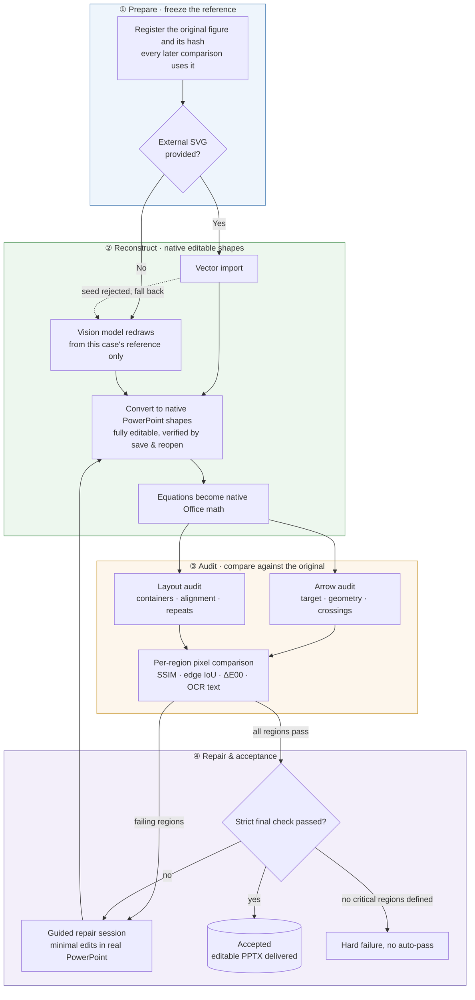

<p align="center"><a href="README.md">简体中文</a> ｜ <strong>English</strong></p>

# AI AutoFigure · autofigure2PPT

Reconstruct research figures as native editable PowerPoint objects, with reference hashes, scene-to-shape bindings, regional QA, and PowerPoint save/reopen evidence.

> Current fact: both input routes now run end to end on a real ModularAgent figure, but both controlled cases remain `qa_failed`. A working pipeline is not the same as mature one-to-one reconstruction quality.

## Overall pipeline



## Two independent dimensions

| Dimension | Values | Meaning |
|---|---|---|
| `input_route` | `reference-only` / `svg-seeded` | What the user supplied when the case was created; immutable |
| `processing_mode` | `svg_import` / `svg_repair` / `png_reconstruct` | The current method; may change after fallback |

`reference-only` means there was no external SVG seed. An internal SVG may still be generated as an offline rendering carrier. `svg-seeded` is vendor-neutral and covers GPT, Kimi, Claude, Codex, or human-authored seeds. Rejecting a seed changes only `processing_mode`, never `input_route`.

## Showcase

Two categories by input route, one case each. In every comparison image the **top half is the original figure, the bottom half the reconstructed render**. Both cases use the same frozen reference; metrics and status are reported as they are.

### 1 · Redraw from a provided SVG (svg-seeded)


[`01-modular-agent`](examples/svg-seeded/01-modular-agent/) (ModularAgent architecture figure; all 196 bound objects verified via save & reopen):

| Metric | Value |
|---|---|
| Bound objects / editable text / native equations | 196 / 44 / 22 |
| Editable arrow objects / arrow-audit findings | 46 / **0** |
| Critical regions passing | 2/6 |
| Status | `qa_failed` (4 region blockers + missing live evidence) |

Machine evidence: [QA_STATUS.md](examples/svg-seeded/01-modular-agent/QA_STATUS.md) · [check-report.md](examples/svg-seeded/01-modular-agent/check-report.md)

### 2 · Redraw from the target PNG only (reference-only)


[`01-modular-agent-reference-only`](examples/reference-only/01-modular-agent-reference-only/) (independent rebuild of the same reference; never read the other case's SVG, PPTX, scene, bindings, or coordinates):

| Metric | Value |
|---|---|
| Bound objects / editable text / native equations | 188 / 45 / 22 |
| Editable arrow objects / arrow-audit findings | 43 / **72** |
| Critical regions passing | 2/6 (the two passing regions are authorized microassets at SSIM/Edge IoU 1.0) |
| Status | `qa_failed` |

Machine evidence: [check-report.md](examples/reference-only/01-modular-agent-reference-only/check-report.md)

Cross-route conclusion: with an SVG seed, arrow topology reaches zero audit findings; with PNG only, the pipeline also runs end to end, but arrow quality (72 findings) is the current main gap. Controlled A/B report: [`route-comparison-modular-agent-route-ab.md`](examples/route-comparison-modular-agent-route-ab.md).

`02-thinking-diffusion` and `03-llmind` have standard diagnostics only (`candidate`, no critical-region contract) and are below the showcase bar; see the full case index in [`examples/README.md`](examples/README.md).

## Quick start

Requirements: Windows, Microsoft PowerPoint, and Python 3.12. Third-party PowerPoint add-ins are not core dependencies.

```bat
python -m venv .venv
.venv\Scripts\pip install -r requirements.txt
```

External SVG seed route:

```bat
autofigure prepare reference.png --case my-case --input-route svg-seeded
autofigure ingest my-case candidate.svg --kind svg --candidate-role external-seed --candidate-origin web-vlm
autofigure convert my-case
autofigure math my-case
autofigure check my-case --profile standard
```

PNG-only route:

```bat
autofigure prepare reference.png --case my-direct-case --input-route reference-only
autofigure ingest my-direct-case candidate.svg --kind svg --candidate-role reconstruction-candidate --candidate-origin codex
autofigure convert my-direct-case
autofigure math my-direct-case
autofigure check my-direct-case --profile strict --require-live
```

`--input-route` is mandatory. The deprecated `--source-mode` option cannot substitute for it or infer historical provenance.

If an external seed is rejected:

```bat
autofigure ingest my-case --rejected --fallback png_reconstruct
```

The case stays under `examples/svg-seeded/`; only `processing_mode` changes.

## Fidelity and editability

- Text, equations, formal nodes, and arrows remain native editable objects.
- Straight arrows prefer native PowerPoint connectors; curved arrows preserve editable freeform paths. Unsupported marker geometry must produce an explicit grouped fallback.
- User-authorized irreducible microassets may be tightly cropped from that case's own `reference.png` and marked `editable=false`. Whole-reference rasterization and rasterized formal structure are forbidden.
- Full-image metrics are diagnostic only. Any failed critical region blocks `approved`.
- Strict validation with zero critical regions fails with `regions:no-critical-regions`.
- PowerPoint Live can expose a visible managed canvas, inspect, audit, save/reopen, and read back objects. It has no release authority and cannot silently convert backend integrity into regional fidelity evidence.

## Contracts and checks

Each case contains `run.json`, `provenance.json`, `scene.json`, `assets.json`, `regions.json`, and `bindings.json`. Canonical provenance uses case-relative paths and SHA-256 hashes, not machine-specific absolute source paths.

```bat
autofigure cases --write-index
autofigure cases --check
autofigure compare 01-modular-agent 01-modular-agent-reference-only
autofigure hygiene
```

Strict acceptance defaults to SSIM ≥ 0.85 and Edge IoU ≥ 0.75 for critical regions, SSIM ≥ 0.95 for authorized raster microassets, plus color, layout, arrow-topology, binding, and optional live-evidence gates.

## PowerPoint add-ins

The default stack is Microsoft PowerPoint, the `powerpoint-live` MCP, and Autofigure itself. OneKeyTools10 is only an isolated pilot candidate; iSlide is an optional manual asset source; ThreeD Tools is deferred until a real 3-D case exists. Beautification and animation add-ins do not enter the automated pipeline. Production automation must not use Ribbon-coordinate clicking, SendKeys, or image-recognition clicking.

## Development verification

```bat
.venv\Scripts\python -m pytest tests -q
.venv\Scripts\python -m ruff check tools tests
.venv\Scripts\python -m compileall -q tools tests
autofigure cases --check
autofigure hygiene
```

See [`PROJECT_ARCHITECTURE.md`](PROJECT_ARCHITECTURE.md), [`HIGH_FIDELITY.md`](HIGH_FIDELITY.md), [`SKILL.md`](SKILL.md), and [`examples/README.md`](examples/README.md).

## License

[MIT](LICENSE) © 2026 let778750-cpu
