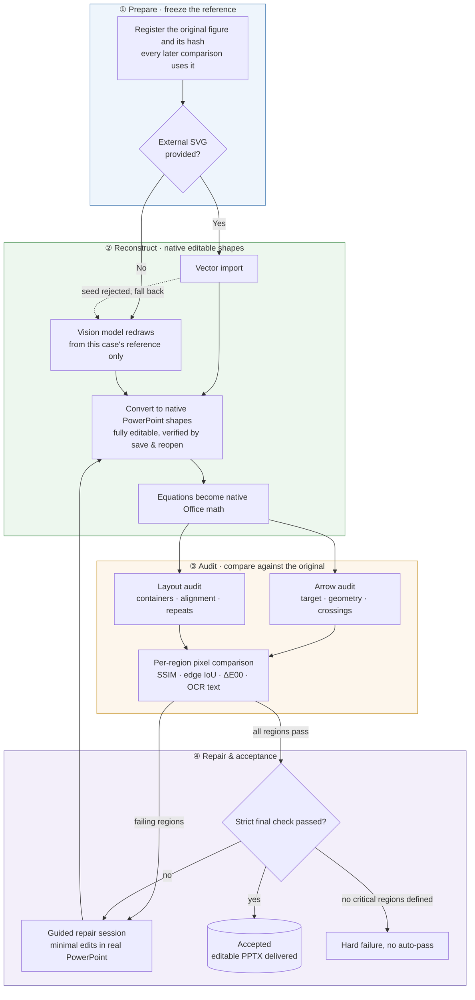

<p align="center"><a href="README.md">简体中文</a> ｜ <strong>English</strong></p>

# AI AutoFigure · autofigure2PPT

Reconstruct research figures as native editable PowerPoint objects, with reference hashes, scene-to-shape bindings, regional QA, and PowerPoint save/reopen evidence.

> Current fact: under schema 4.0, both input routes run end to end across three real research figures (ModularAgent, Thinking Diffusion, Pareto-Conditioned Diffusion — 7 cases in total), but **every case remains `qa_failed`**. The svg-seeded Thinking Diffusion case now passes all 18 critical regions and the arrow physical gate, with only the save/reopen and Live evidence chain still open. A working pipeline is not the same as mature one-to-one reconstruction quality.

## Overall pipeline



## Two independent dimensions

| Dimension | Values | Meaning |
|---|---|---|
| `input_route` | `reference-only` / `svg-seeded` | What the user supplied when the case was created; immutable |
| `processing_mode` | `svg_import` / `svg_repair` / `png_reconstruct` | The current method; may change after fallback |

`reference-only` means there was no external SVG seed. An internal SVG may still be generated as an offline rendering carrier. `svg-seeded` is vendor-neutral and covers GPT, Kimi, Claude, Codex, or human-authored seeds. Rejecting a seed changes only `processing_mode`, never `input_route`.

## Showcase

Three real research figures, each shown as a controlled A/B across both input routes. In every comparison image the **top half is the original figure, the bottom half the reconstructed render**. All metrics come from schema 4.0 machine evidence and are reported as they are — no case has reached `approved`.

### Theme 1 · ModularAgent architecture (same frozen reference, controlled A/B)

**Redraw from a provided SVG (svg-seeded)**


[`01-modular-agent`](examples/svg-seeded/01-modular-agent/):

| Metric | Value |
|---|---|
| Bound objects / editable text / native equations | 211 / 44 / 22 |
| ArrowSpec compile / arrow physical gate | 41 PASS / **FAIL** |
| Critical regions passing | 5/12 (all passing regions are authorized tightly-cropped microassets) |
| Status | `qa_failed` |

**Redraw from the target PNG only (reference-only; never read the other case's SVG, PPTX, scene, bindings, or coordinates)**


[`01-modular-agent-reference-only`](examples/reference-only/01-modular-agent-reference-only/):

| Metric | Value |
|---|---|
| Bound objects / editable text / native equations | 185 / 45 / 22 |
| ArrowSpec compile / arrow physical gate | 39 PASS / **FAIL** |
| Critical regions passing | 3/10 (two are authorized microassets at SSIM/Edge IoU 1.0) |
| Status | `qa_failed` |

Controlled A/B report: [`route-comparison-modular-agent-route-ab.md`](examples/route-comparison-modular-agent-route-ab.md).

### Theme 2 · Thinking Diffusion pipeline

**svg-seeded**


[`02-thinking-diffusion`](examples/svg-seeded/02-thinking-diffusion/):

| Metric | Value |
|---|---|
| Bound objects / editable text | 156 / 46 |
| ArrowSpec compile / arrow physical gate | 6 PASS / **PASS** |
| Critical regions passing | **18/18 — all pass** |
| Status | `qa_failed` (19 blockers, all in the unclosed save/reopen and Live evidence chain; every visual gate passes) |

**reference-only**


[`02-thinking-diffusion-reference-only`](examples/reference-only/02-thinking-diffusion-reference-only/):

| Metric | Value |
|---|---|
| Bound objects / editable text | 147 / 51 |
| ArrowSpec compile / arrow physical gate | 6 PASS / **FAIL** |
| Critical regions passing | 4/8 |
| Status | `qa_failed` |

### Theme 3 · Pareto-Conditioned Diffusion (currently the largest fidelity gap)

**svg-seeded**


[`04-pareto-conditioned-diffusion`](examples/svg-seeded/04-pareto-conditioned-diffusion/):

| Metric | Value |
|---|---|
| Bound objects / editable text / microasset member readbacks | 159 / 17 / 94 (AssetSpec PASS) |
| ArrowSpec compile / arrow physical gate | 5 PASS / **PASS** |
| Critical regions passing | 1/38 (DNA double-helix regions at SSIM 0.11–0.14; molecule and candlestick regions 0.29–0.32) |
| Status | `qa_failed` (sub-element fidelity + 38 font/scale contract failures) |

**reference-only**


[`04-pareto-conditioned-diffusion-reference-only`](examples/reference-only/04-pareto-conditioned-diffusion-reference-only/):

| Metric | Value |
|---|---|
| Bound objects / editable text / microasset member readbacks | 184 / 14 / 152 (AssetSpec PASS) |
| ArrowSpec compile / arrow physical gate | 9 PASS / **FAIL** |
| Critical regions passing | 0/28 |
| Status | `qa_failed` |

Controlled A/B report: [`route-comparison-pareto-conditioned-diffusion-route-ab.md`](examples/route-comparison-pareto-conditioned-diffusion-route-ab.md).

Cross-theme conclusion: both routes run end to end and bind objects to native editable shapes; the gaps concentrate in three places — the arrow physical gate on reference-only, pixel-level fidelity of complex sub-elements (DNA, molecules, candlestick charts), and the save/reopen plus Live evidence chain shared by all cases. `03-llmind` carries standard diagnostics only and stays below the showcase bar; see the full case index in [`examples/README.md`](examples/README.md).

## Quick start

Requirements: Windows, Microsoft PowerPoint, and Python 3.12. Third-party PowerPoint add-ins are not core dependencies.

```bat
python -m venv .venv
.venv\Scripts\pip install -r requirements.txt
```

External SVG seed route:

```bat
autofigure prepare reference.png --case my-case --input-route svg-seeded
rem Inventory the current reference in regions.json, then freeze the closed-world contract
autofigure freeze my-case
autofigure ingest my-case candidate.svg --kind svg --candidate-role external-seed --candidate-origin web-vlm
autofigure convert my-case
autofigure math my-case
autofigure check my-case --profile standard
```

PNG-only route:

```bat
autofigure prepare reference.png --case my-direct-case --input-route reference-only
rem Inventory the current reference in regions.json, then freeze the closed-world contract
autofigure freeze my-direct-case
autofigure ingest my-direct-case candidate.svg --kind svg --candidate-role reconstruction-candidate --candidate-origin codex
autofigure convert my-direct-case
autofigure math my-direct-case
autofigure check my-direct-case --profile strict
```

`--input-route` is mandatory. The deprecated `--source-mode` option cannot substitute for it or infer historical provenance.

If an external seed is rejected:

```bat
autofigure ingest my-case --rejected --fallback png_reconstruct
```

The case stays under `examples/svg-seeded/`; only `processing_mode` changes.

## Fidelity and editability

- Text, equations, formal nodes, and arrows remain native editable objects.
- Straight arrows compile to one native PowerPoint line/connector and fixed curves to one editable freeform; marker geometry that cannot remain one visible object fails strict validation.
- User-authorized irreducible microassets may be tightly cropped from that case's own `reference.png` and marked `editable=false`. Whole-reference rasterization and rasterized formal structure are forbidden.
- Full-image metrics are diagnostic only. Any failed critical region blocks `approved`.
- Strict validation with zero critical regions fails with `regions:no-critical-regions`.
- Every new case starts with a required, draft `reference_inventory`. Candidate ingest is refused until `autofigure freeze` validates complete reference-derived objects, critical-region coverage, exact text/typography, and arrow/brace/icon contracts, then writes a hash-bound receipt. Any later contract or task drift invalidates the receipt.
- Strict validation cannot skip OCR and always requires hash-bound PowerPoint Live finalizer evidence (`--require-live` remains a compatibility no-op). PowerPoint Live has no release authority and cannot silently convert backend integrity into regional fidelity evidence.

## Contracts and checks

Each case contains `run.json`, `provenance.json`, `scene.json`, `assets.json`, `regions.json`, and `bindings.json`. Canonical provenance uses case-relative paths and SHA-256 hashes, not machine-specific absolute source paths.

```bat
autofigure cases --write-index
autofigure cases --check
autofigure compare 01-modular-agent 01-modular-agent-reference-only
autofigure hygiene
```

Strict acceptance defaults to SSIM ≥ 0.85 and Edge IoU ≥ 0.75 for critical regions, SSIM ≥ 0.95 for authorized raster microassets, plus color, layout, arrow-topology, binding, mandatory OCR, inventory closure, and mandatory Live-finalizer gates.

## PowerPoint add-ins

The default stack is Microsoft PowerPoint, the `powerpoint-live` MCP, and Autofigure itself. OneKeyTools10 is only an isolated pilot candidate; iSlide is an optional manual asset source; ThreeD Tools is deferred until a real 3-D case exists. Beautification and animation add-ins do not enter the automated pipeline. Production automation must not use Ribbon-coordinate clicking, SendKeys, or image-recognition clicking.

## Development verification

```bat
.venv\Scripts\python -m pytest tests -q
.venv\Scripts\python -m ruff check tools tests
.venv\Scripts\python -m compileall -q tools tests
autofigure cases --check
autofigure hygiene
```

See [`PROJECT_ARCHITECTURE.md`](PROJECT_ARCHITECTURE.md), [`HIGH_FIDELITY.md`](HIGH_FIDELITY.md), [`SKILL.md`](SKILL.md), and [`examples/README.md`](examples/README.md).

## License

[MIT](LICENSE) © 2026 let778750-cpu
