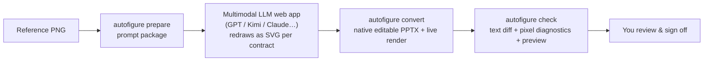

<p align="center"><a href="README.md">简体中文</a> ｜ <strong>English</strong></p>

# AI AutoFigure · autofigure2PPT

**Turn research-paper figures (PNG) into PowerPoints you can truly edit — editable text, re-editable equations, pixel-perfect photos.**

[](LICENSE)
[](requirements-v2.txt)
[](#-faq)
[](examples/README.md)

Paper figures look great — until you need to change one word. Revision round asks for a new module name, a group meeting needs your lab's color scheme, and suddenly you're tracing shapes by hand or begging the original author. AI AutoFigure turns this into a pipeline: **a multimodal LLM redraws the figure, a deterministic toolchain converts it into native PPTX objects and verifies it**, and you sign off.

## 🎬 Showcase

Every preview below is "top: original paper figure ｜ bottom: native PowerPoint render of the delivered PPTX".

| Case (all CVPR 2026 figures) | Size | Native shapes | Text boxes | OMML equations | mean↓ | SSIM↑ | changed↓ |
|---|---|---:|---:|---:|---:|---:|---:|
| 01 ModularAgent | 1429×627 | 243 | 66 | **22** | 16.62 | 0.733 | 38.27% |
| 02 Thinking Diffusion | 1513×554 | 162 | 46 | — | 13.55 | 0.720 | 17.97% |
| 03 LLMind | 1357×656 | 201 | 34 | **6** | **6.87** | **0.868** | **12.97%** |

### 01 · ModularAgent — the hardest one

Redrawn by GPT in one shot, then refined in a second self-critique round (solid arrows matching the original, atomic photo crops), then deterministically repaired at the arrow-geometry level (42 anchor misalignments zeroed; curved arrowheads aligned to end tangents; gold arrowheads calibrated to the original's measured head length). All 243 native shapes are editable, and 22 formulas (𝔼, ∇, sub/superscripts) were upgraded to native Office Math.


### 02 · Thinking Diffusion — swap the model, keep the tool

Hand-written as SVG by Kimi following the output contract, with zero unmatched text on read-back — proof that the toolchain is model-agnostic.


### 03 · LLMind — best pixel scores

Redrawn by GPT; two photographs embedded pixel-perfect from the source image. Best mean / SSIM / changed of the three cases.


> **About the metrics**: mean / SSIM / changed measure "how closely the render matches the original". They are advisory diagnostics, not gates — acceptance in this project is **100% of text read back as editable + human review of the side-by-side preview**. Figures 01 / 03 are measured after equations were upgraded to native Office Math (slightly higher than the plain-textbox variant, in exchange for editability). For comparison, the archived v1 heavyweight deterministic pipeline (4 days / ~30 rounds / 27k LOC) scored mean 19.9987 / SSIM 0.6535 / changed 46.55% (see `legacy/`).
>
> Each case directory contains the deliverable itself: `redraw.pptx` opens directly in PowerPoint / WPS.

## ✨ Features

- **✏️ 100% editable text** — every glyph is a native PowerPoint text box. Double-click and type. No screenshots, no path-traced letters.
- **🧮 Native Office Math equations** — sub/superscripts, Greek letters, 𝔼/∇ formulas are batch-upgraded to native OMML objects you can keep editing in PowerPoint's equation editor.
- **🖼️ Zero-distortion photos** — photographs, screenshots and other realistic regions are pixel-cropped from **your source image** by the tool. The AI never gets to "paint" a photo.
- **🔁 Any model works** — GPT, Kimi, Claude… any multimodal LLM web app. The toolchain trusts the output contract, not the vendor.
- **🔍 Verification built in** — every conversion produces a text diff, pixel diagnostics, and a side-by-side preview. You review evidence, not a black box.
- **📦 Deliverable out of the box** — the output is a standard `.pptx`. No plugins, no special environment needed to keep editing.

## 🔧 How it works (30-second version)

The split of labor is simple: **LLMs are good at seeing; tools are good at being exact.** The multimodal model redraws your figure as contract-compliant SVG; this toolchain deterministically converts and verifies it — no guessing, no hand-waving.



### Why the quality holds

You don't need to read the technical contract — the tool enforces it for you:

- **Why text is guaranteed editable**: the tool only accepts SVGs where text is written verbatim as text elements; letters drawn as paths are rejected outright. After conversion, a full text read-back verifies every box.
- **Why equations stay editable**: the `math` command upgrades sub/superscript formulas into native PowerPoint equation objects (OMML) — double-click and you're in the familiar equation editor.
- **Why photos never warp**: the contract requires realistic regions to be declared as placeholders, and the converter crops them from your original image — the AI has no authority to "repaint" a photograph.
- **Why layout doesn't drift**: canvas size must match the source pixels exactly; arrow weight, head style, and bends follow the original — no template styling.
- Full technical contract: [`references/v2-prompt-contract.md`](references/v2-prompt-contract.md).

## 🚀 Quick Start

### What you'll need

- A **Windows** machine with **PowerPoint** installed (live rendering and equation injection drive local Office)
- **Python 3.12**
- Web access to any **multimodal LLM** (GPT / Kimi / Claude… — free tiers are usually enough for one figure)
- A paper figure **PNG**

### Install (once)

```bat
python -m venv .venv
.venv\Scripts\pip install -r requirements-v2.txt
```

### Four steps to an editable PPTX

Open a terminal in the project root and run one step at a time — each tells you exactly what you got:

```bat
REM ① Create the case directory + prompt package
autofigure prepare my-figure.png --case 01-my-figure
```
→ You get `examples\01-my-figure\prompt.md` — a ready-made prompt with the output contract baked in.

```bat
REM ② The only manual step: send the prompt to an LLM
```
→ Open your multimodal LLM web app, paste the full `prompt.md` together with the source image, and save the returned SVG as `examples\01-my-figure\redraw.svg`. It's copy-paste.

```bat
REM ③ Convert + live render
autofigure convert examples\01-my-figure
```
→ You get `redraw.pptx` (★ the editable deliverable) and `render.png` (what PowerPoint actually renders).

```bat
REM ④ Verify + side-by-side preview
autofigure check examples\01-my-figure
```
→ You get `check-report.md` (text diff + pixel diagnostics) and `preview.png` (original on top, render below). Review, approve, done.

```bat
REM Optional: upgrade equations to native Office Math
autofigure math examples\01-my-figure
```
→ Formula text boxes (sub/superscripts, short italic formulas) become re-editable native equation objects; `--dry-run` detects only, without touching the file.

```bat
REM Optional: audit / deterministically repair arrow geometry (rerun convert → math → check afterwards)
autofigure arrows examples\01-my-figure --fix
```
→ Audits arrow anchors, head/line-width ratios, and endpoint docking into the check report; `--fix` normalizes geometry without touching styles, `--clamp-ratio` caps head length, and `--calibrate ID=LEN` matches head length to the original's measured size.

## ❓ FAQ

<details>
<summary><b>Do I need Windows + PowerPoint?</b></summary>

Live rendering (`render`) and equation injection (`math`) drive local Office via COM, so they currently require Windows with PowerPoint installed. The `.pptx` deliverable itself is a standard file — open and edit it in PowerPoint, WPS, or Keynote on any platform.
</details>

<details>
<summary><b>Which LLM should I use?</b></summary>

Any multimodal LLM web app that can see images and output SVG. Cases 01 / 03 used GPT, case 02 used Kimi — all passed. The toolchain only validates contract compliance, regardless of vendor. Stronger models pass on the first try more often.
</details>

<details>
<summary><b>Does the OCR in check touch anything on my machine?</b></summary>

No. OCR runs **read-only**, once, over the reference image — solely to diff text for omissions and typos. It never goes online and never writes files. Without an OCR environment configured, the pixel diagnostics and side-by-side preview still work.
</details>

<details>
<summary><b>Will photos and screenshots get AI-warped?</b></summary>

No. The contract requires realistic regions to be placeholders; the converter pixel-crops them from your source image at the declared coordinates. What gets embedded is exactly your original image.
</details>

<details>
<summary><b>What are mean / SSIM in the table? What if they're "bad"?</b></summary>

They measure how closely the render matches the original — advisory diagnostics only. The tool never auto-passes or auto-blocks on them; acceptance is always 100% editable text read-back plus your own review of the side-by-side preview.
</details>

<details>
<summary><b>How is this different from pasting a screenshot into PowerPoint?</b></summary>

A screenshot is inert: you can't fix a typo, recolor, or move a module. This project produces native PowerPoint objects — editing text, colors, deletions, and relayout work exactly like editing any normal slide.
</details>

## 📄 License

[MIT](LICENSE) © 2026 let778750-cpu

## 📚 For developers

> The Chinese [`README.md`](README.md) is the authoritative version; this translation follows it.

| Doc | Contents |
|---|---|
| [`SKILL.md`](SKILL.md) | Formal operating instructions & red lines |
| [`PROJECT_ARCHITECTURE.md`](PROJECT_ARCHITECTURE.md) | Full pipeline architecture (prepare / convert / check / math) |
| [`references/v2-prompt-contract.md`](references/v2-prompt-contract.md) | Full VLM output contract |
| [`examples/README.md`](examples/README.md) | Case index & artifact conventions |
| [`legacy/`](legacy/) | Archived v1 heavyweight pipeline (unmaintained since 2026-08-18; the math command reuses its equation engine) |

Development & tests (46 tests, all runnable offline):

```bat
.venv\Scripts\python -m pytest tests\v2 -q
.venv\Scripts\python -m ruff check tools\v2 tests\v2
```

Runtime environments: all v2 commands run in the project `.venv` (deps in `requirements-v2.txt`); the OCR text diff in check uses a separate read-only PaddleOCR environment (config pinned in `legacy/ocr-config.json`); live rendering drives local PowerPoint COM.
