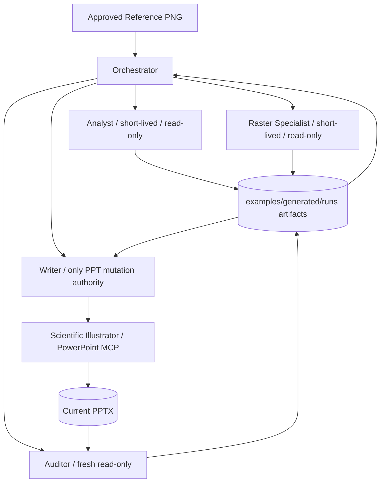
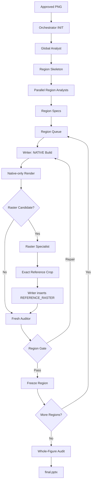
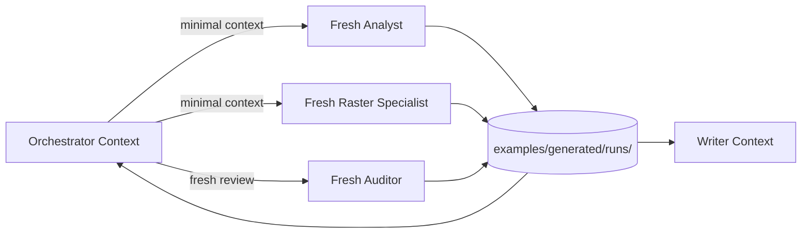
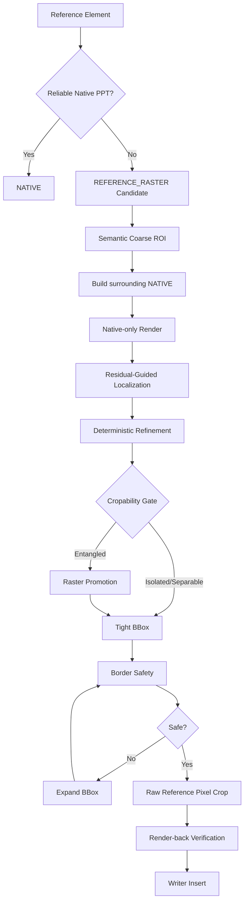
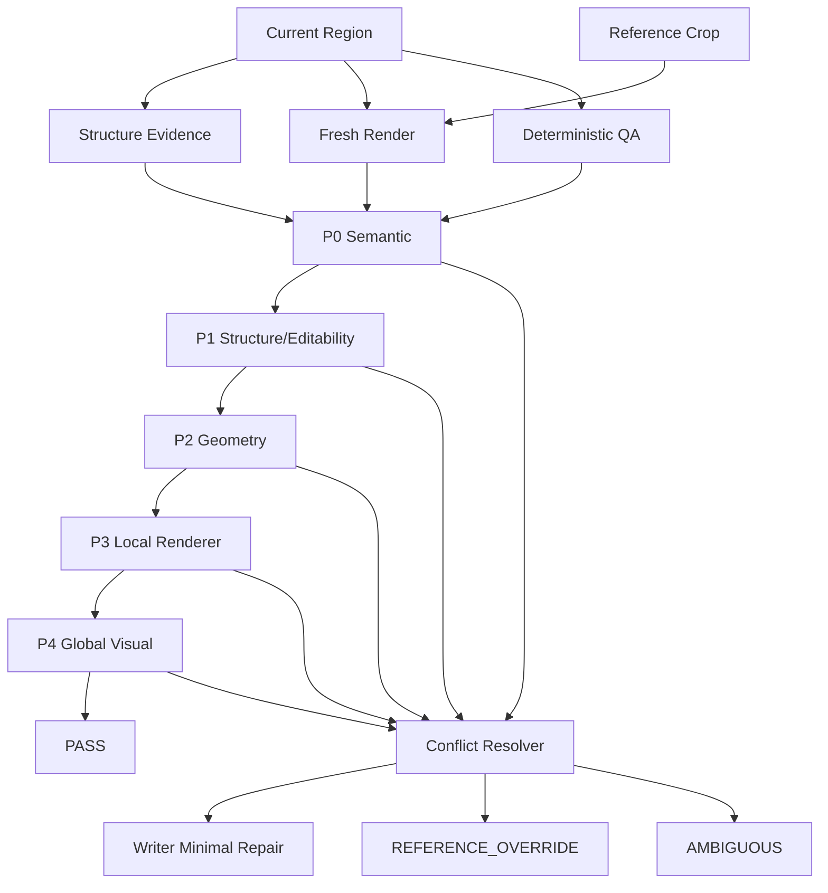
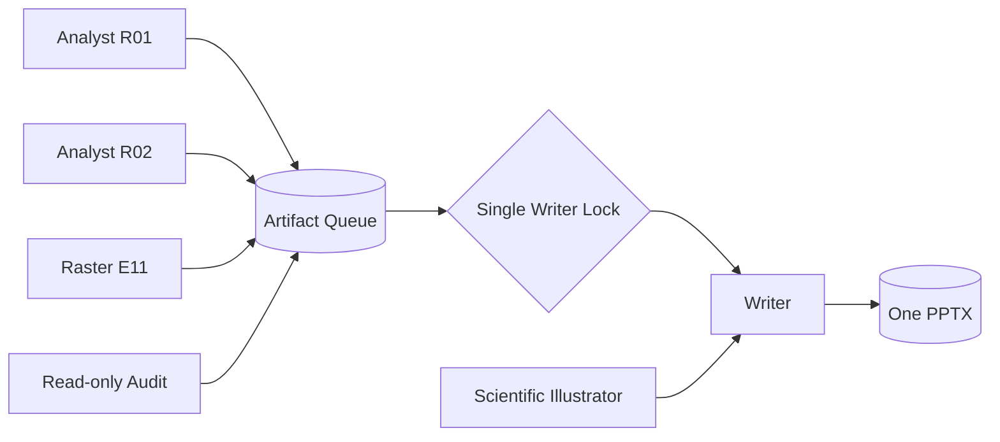
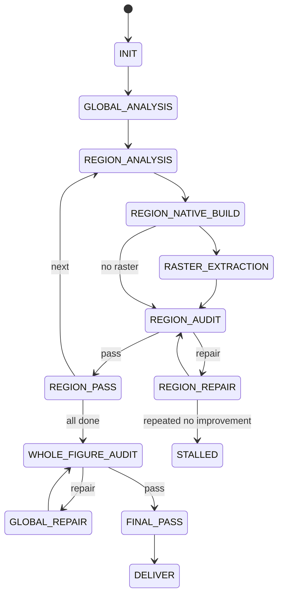
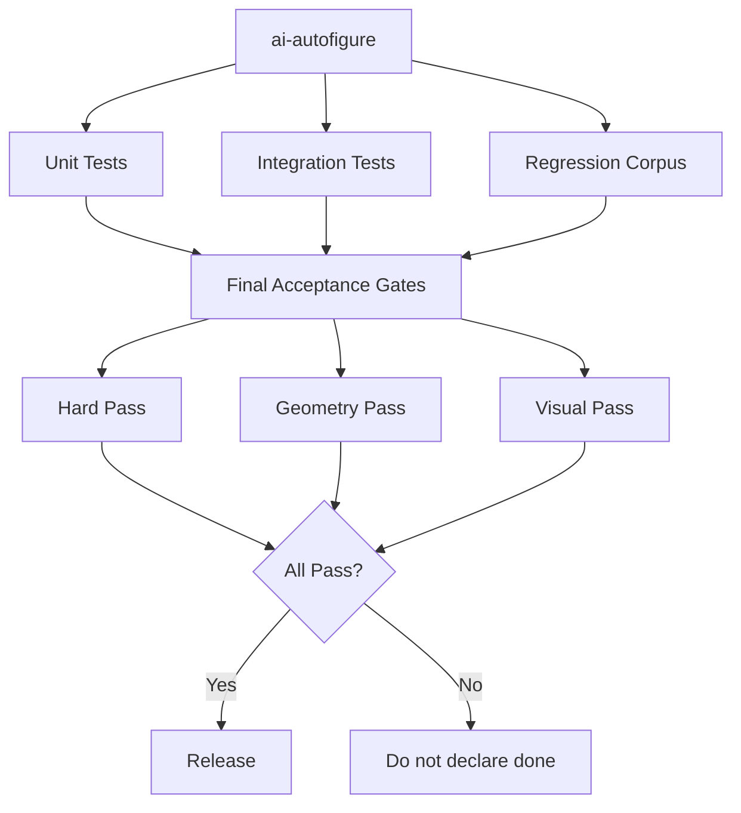
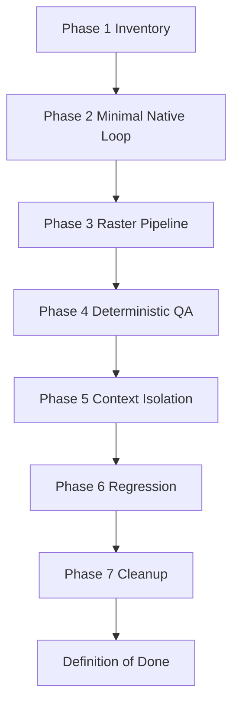
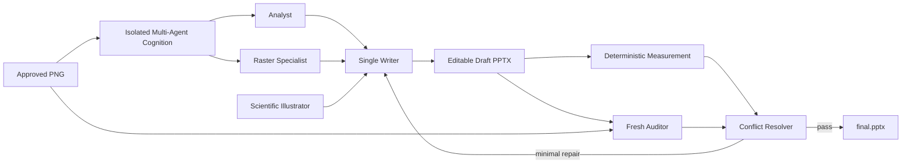

# AI AutoFigure 最终版系统架构图 V3
## 与《AI AutoFigure 最终版重构优化方案 V3》严格一一对应

**适用项目：** `D:\AI+科研\AI智能绘图（最终版）\AI autofigure - 副本\ai-autofigure`  
**配套方案文件：** `AI_AutoFigure_最终版重构优化方案_V3.md`  
**架构编号：** `ARCH-01 ~ ARCH-10`  
**显示策略：** **SVG 预览优先 + Mermaid 源码保留**。即使 Markdown 阅读器不支持 Mermaid，仍应能直接看到 SVG 架构图。  
**核心原则：** Approved PNG = Visual Authority；Multi-Agent Cognition；Single Writer Mutation；Read Parallel / Write Serial；Fresh Evidence > Historical Context。

---

# 0. 架构追踪矩阵

| 编号 | 架构主题 | 严格对应重构方案 |
|---|---|---|
| `ARCH-01` | 多 Agent 总体拓扑与权限边界 | §3 |
| `ARCH-02` | Approved PNG → final.pptx 端到端主流程 | §4、§6、§31 |
| `ARCH-03` | Context Firewall 与 Artifact-first Handoff | §5、§30 |
| `ARCH-04` | NATIVE / REFERENCE_RASTER 与精确裁剪链路 | §7–§12 |
| `ARCH-05` | P0–P4 QA、冲突裁决与最小修复闭环 | §13–§17 |
| `ARCH-06` | 项目依赖与 Read Parallel / Write Serial | §18–§23 |
| `ARCH-07` | 运行状态机、异常与 STALLED 防死循环 | §24–§25 |
| `ARCH-08` | 测试、回归与最终验收 | §26–§27 |
| `ARCH-09` | Agent Handoff 与 Phase 1–7 工程落地 | §30–§31 |
| `ARCH-10` | 最终系统总览与权威优先级 | §32–§35 |

---

# 1. 使用与预览规则

1. 每个 `ARCH-*` 先引用 `architecture/ARCH-XX.svg`，这是**跨 Markdown 阅读器的正式预览**；
2. SVG 下方保留 Mermaid 源码，主要供 AI、版本控制与后续架构修改使用；
3. 当前编辑器支持 Mermaid 时可额外渲染源码；不支持 Mermaid 时也不影响 SVG 预览；
4. `architecture/*.svg` 是架构的渲染产物，不是独立真值；
5. 修改流程逻辑后必须同步更新 Mermaid/架构定义并重新生成 SVG；
6. 本文件与 `AI_AutoFigure_最终版重构优化方案_V3.md` 任何一处发生角色、状态、Gate、目录或执行顺序不一致，均视为文档测试失败。

---

# ARCH-01 — 多 Agent 总体拓扑与权限边界
**严格对应方案：§3**


<details>
<summary>Mermaid 源码（用于 AI/版本控制；普通阅读器无需渲染）</summary>



</details>

---

# ARCH-02 — Approved PNG → final.pptx 端到端主流程
**严格对应方案：§4、§6、§31**


<details>
<summary>Mermaid 源码（用于 AI/版本控制；普通阅读器无需渲染）</summary>



</details>

---

# ARCH-03 — Context Firewall 与 Artifact-first Handoff
**严格对应方案：§5、§30**


<details>
<summary>Mermaid 源码（用于 AI/版本控制；普通阅读器无需渲染）</summary>



</details>

---

# ARCH-04 — NATIVE / REFERENCE_RASTER 与精确裁剪链路
**严格对应方案：§7–§12**


<details>
<summary>Mermaid 源码（用于 AI/版本控制；普通阅读器无需渲染）</summary>



</details>

---

# ARCH-05 — P0–P4 QA、冲突裁决与最小修复闭环
**严格对应方案：§13–§17**


<details>
<summary>Mermaid 源码（用于 AI/版本控制；普通阅读器无需渲染）</summary>



</details>

---

# ARCH-06 — 项目依赖与 Read Parallel / Write Serial
**严格对应方案：§18–§23**


<details>
<summary>Mermaid 源码（用于 AI/版本控制；普通阅读器无需渲染）</summary>



</details>

---

# ARCH-07 — 运行状态机、异常与 STALLED 防死循环
**严格对应方案：§24–§25**


<details>
<summary>Mermaid 源码（用于 AI/版本控制；普通阅读器无需渲染）</summary>



</details>

---

# ARCH-08 — 测试、回归与最终验收
**严格对应方案：§26–§27**


<details>
<summary>Mermaid 源码（用于 AI/版本控制；普通阅读器无需渲染）</summary>



</details>

---

# ARCH-09 — Agent Handoff 与 Phase 1–7 工程落地
**严格对应方案：§30–§31**


<details>
<summary>Mermaid 源码（用于 AI/版本控制；普通阅读器无需渲染）</summary>



</details>

---

# ARCH-10 — 最终系统总览与权威优先级
**严格对应方案：§32–§35**


<details>
<summary>Mermaid 源码（用于 AI/版本控制；普通阅读器无需渲染）</summary>



</details>

---

# 12. 权威优先级与执行不变量

```text
Invariant Hard Constraints
        >
Approved Reference Fidelity
        >
Fresh Render / Fresh Structure Evidence
        >
Deterministic Geometry & QA Evidence
        >
Scientific Style Advice（当前 Reconstruction-only 阶段不自动执行）
```

必须始终满足：

- Writer 是唯一 PowerPoint mutation authority；
- Analyst / Raster Specialist / Auditor 均不可写 PPT；
- Auditor 不能依据 Writer 的“成功声明”通过；
- Raster 最终像素必须直接来自 approved reference；
- ENTANGLED raster 使用 Raster Promotion，而不是引入生成式补图；
- SSIM / pixel similarity 不得越级覆盖 P0/P1/P2；
- 通过区域先 Freeze，除非 fresh whole-figure evidence 明确要求解冻；
- 同一 finding 连续两次无改善或震荡时进入 `STALLED`；
- 当前版本禁止 beautification / redesign / restyle / scientific normalization。

---

# 13. 一致性检查清单

```text
[ ] 已读取 AI_AutoFigure_最终版重构优化方案_V3.md
[ ] 已读取 AI_AutoFigure_最终版系统架构图_V3.md
[ ] ARCH-01 ~ ARCH-10 全部存在
[ ] architecture/ARCH-01.svg ~ ARCH-10.svg 全部存在
[ ] 角色名称完全一致
[ ] Single Writer 权限一致
[ ] NATIVE / REFERENCE_RASTER 定义一致
[ ] Cropability Gate 与 Raster Promotion 一致
[ ] P0–P4 QA 一致
[ ] 状态机与异常状态一致
[ ] Phase 1–7 一致
[ ] Definition of Done 一致
[ ] 项目路径一致
```

**唯一合法项目路径：**

```text
D:\AI+科研\AI智能绘图（最终版）\AI autofigure - 副本\ai-autofigure
```

两份 Markdown 与 `architecture/` SVG 目录应作为一个不可拆分的文档规范包使用。
